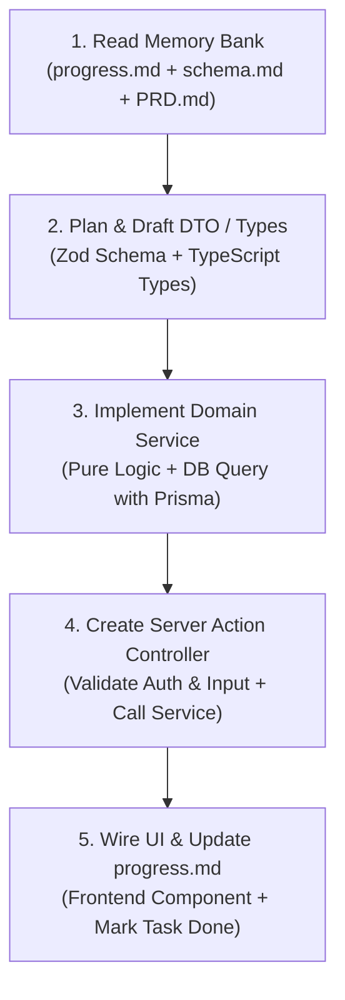

# AI Agent Operating Manual & Governance Guidelines (AGENTS.md)
## โครงการ: ระบบเช็คชื่อ มหาวิทยาลัยมหาจุฬาลงกรณราชวิทยาลัย (MCU Smart Attendance System)
**สถานะ:** กฎเหล็กและคู่มือปฏิบัติการสำหรับ AI Agents ทุกตัวที่เข้ามาร่วมพัฒนาใน Repository นี้  
**การบังคับใช้:** บังคับใช้ในทุกรอบการเขียนโค้ด (Mandatory Enforcement)

---

## 1. กฎเหล็กที่ห้ามละเมิดเด็ดขาด (Critical Non-Negotiable Rules)

1. **Rule 1: Always Read Context Before Writing Code (ต้องอ่านหน่วยความจำก่อนลงมือ):**
   * ก่อนเริ่ม Task ใดๆ Agent ต้องอ่านเอกสาร `progress.md`, `schema.md` และ `architecture.md` เพื่อทำความเข้าใจสถานะปัจจุบันและห้ามเดาโครงสร้างตารางข้อมูลเอง
2. **Rule 2: Never Use `any` Type (ห้ามใช้ `any` ใน TypeScript):**
   * โค้ดทั้งหมดต้องเป็น Type-Safe 100% หากไม่แน่ใจให้ใช้ `unknown` ร่วมกับ Zod Parsing หรือ Type Narrowing
3. **Rule 3: Strict Domain Separation (แยก Business Logic ออกจาก UI):**
   * ห้ามเขียนคำสั่ง Prisma Client หรือ Business Logic ใน `page.tsx` หรือ Client Component โดยตรงเด็ดขาด! Business Logic ต้องอยู่ใน `src/modules/<domain>/<domain>.service.ts` เท่านั้น โดยมี Server Actions ใน `src/server-actions/` ทำหน้าที่เป็น Controller
4. **Rule 4: Zero Trust on Client Time (ห้ามเชื่อเวลาจากเครื่องไคลเอนต์):**
   * การตัดสินสถานะ มา/สาย/ขาด ต้องอ้างอิงจากเวลาของ Server NTP Clock (`new Date()` บนฝั่งเซิร์ฟเวอร์) ห้ามรับค่าเวลาจากฝั่ง Client มาบันทึกเป็นอันขาด
5. **Rule 5: Monastic Respect in Display (รักษาความถูกต้องของสมณสารูป):**
   * สำหรับผู้ใช้ที่เป็น `MONK` (พระภิกษุ/สามเณร) ห้ามบังคับกรอกนามสกุล และการแสดงผลชื่อต้องนำหน้าด้วยสมณศักดิ์หรือฉายาเสมอ เช่น "พระมหาบุญเลิศ กิตฺติปญฺโญ"
6. **Rule 6: Immutable Audit Trail (ประวัติการแก้ไขต้อง Append-Only):**
   * ห้ามสร้างฟังก์ชันแก้ไข (UPDATE) หรือลบ (DELETE) บนตาราง `audit_logs` โค้ดที่แตะต้องตารางนี้ต้องเป็นคำสั่ง `create` เท่านั้น
7. **Rule 7: Never Commit Secrets (ห้ามฝังรหัสผ่านหรือ Secrets ลงในโค้ด):**
   * ต้องอ่านค่าผ่าน `process.env` และมีไฟล์ `.env.example` เป็นแม่แบบเสมอ

---

## 2. Naming Conventions & Code Style

* **ไฟล์และโฟลเดอร์:**
  * Component Files: `PascalCase.tsx` (เช่น `DynamicQrViewer.tsx`, `RosterTable.tsx`)
  * Service Files: `kebab-case.service.ts` (เช่น `attendance.service.ts`)
  * Server Actions: `kebab-case.actions.ts` (เช่น `attendance.actions.ts`)
  * Type / Schema Files: `kebab-case.types.ts` (เช่น `attendance.types.ts`)
* **ตัวแปรและฟังก์ชัน:**
  * ฟังก์ชันและตัวแปรทั่วไป: `camelCase` (เช่น `verifyCheckInToken`, `sessionDate`)
  * Database Model & Prisma Types: `PascalCase` (เช่น `AttendanceRecord`, `User`)
  * Enums & Constants: `SCREAMING_SNAKE_CASE` (เช่น `DYNAMIC_QR`, `RELIGIOUS_DUTY`)
* **การจัดการข้อผิดพลาด (Error Handling):**
  * ทุกฟังก์ชันต้องส่งกลับรูปแบบ `ApiResponse<T>` ที่มี `success: boolean`, `data?: T`, และ `error?: { code: string; message: string }` โดยข้อความแจ้งเตือนต้องเป็นภาษาไทยที่สุภาพและเข้าใจง่าย

---

## 3. Reference Architecture Pattern & Code Examples

เพื่อให้ AI Agents ทุกตัวเขียนโค้ดไปในทิศทางเดียวกัน ต่อไปนี้คือตัวอย่างโครงสร้างที่ถูกต้องสำหรับ **DTO (Validation) $\rightarrow$ Service Layer $\rightarrow$ Controller (Server Action) $\rightarrow$ Client UI Component**:

### 3.1 ตัวอย่าง DTO & Validation Schema (`src/types/attendance.types.ts`)

```typescript
import { z } from "zod";
import { AttendanceStatus, VerificationMethod } from "@prisma/client";

// DTO สำหรับรับข้อมูลการสแกนเช็คชื่อจากนิสิต
export const VerifyCheckInSchema = z.object({
  sessionId: z.string().uuid({ message: "รหัสรอบเช็คชื่อไม่ถูกต้อง" }),
  token: z.string().min(16, { message: "โทเคนเช็คชื่อไม่ถูกต้องหรือสั้นเกินไป" }),
  deviceFingerprint: z.string().optional(),
});

export type VerifyCheckInInput = z.infer<typeof VerifyCheckInSchema>;

// รูปแบบผลลัพธ์การเช็คชื่อ
export interface CheckInResult {
  recordId: string;
  referenceCode: string;
  status: AttendanceStatus;
  method: VerificationMethod;
  checkedInAt: Date;
  studentName: string;
  courseTitle: string;
}

// รูปแบบมาตรฐาน Standard Response
export interface ActionResponse<T = unknown> {
  success: boolean;
  data?: T;
  error?: {
    code: string;
    message: string;
  };
}
```

### 3.2 ตัวอย่าง Domain Service Layer (`src/modules/attendance/attendance.service.ts`)

```typescript
import { prisma } from "@/lib/db";
import { redis } from "@/lib/redis";
import { AttendanceStatus, VerificationMethod } from "@prisma/client";
import { CheckInResult } from "@/types/attendance.types";

export class AttendanceService {
  /**
   * ตรวจสอบความถูกต้องของ Dynamic QR Token และบันทึกเวลาเรียน
   */
  static async verifyAndRecordAttendance(params: {
    sessionId: string;
    token: string;
    studentId: string;
    ipAddress?: string;
    userAgent?: string;
  }): Promise<CheckInResult> {
    const { sessionId, token, studentId, ipAddress, userAgent } = params;

    // 1. ดึงข้อมูล Session จากฐานข้อมูล
    const session = await prisma.attendanceSession.findUnique({
      where: { id: sessionId },
      include: {
        courseOffering: {
          include: {
            course: true,
            enrollments: { where: { studentId, status: "ENROLLED" } },
          },
        },
      },
    });

    if (!session) {
      throw new Error("SESSION_NOT_FOUND: ไม่พบข้อมูลรอบการเช็คชื่อนี้");
    }

    if (session.isClosed) {
      throw new Error("SESSION_CLOSED: รอบการเช็คชื่อนี้ปิดแล้ว");
    }

    // 2. ตรวจสอบว่าผู้ใช้อยู่ในรายชื่อนิสิตที่ลงทะเบียนหรือไม่
    if (session.courseOffering.enrollments.length === 0) {
      throw new Error("NOT_ENROLLED: นิสิตไม่ได้ลงทะเบียนในรายวิชานี้");
    }

    // 3. ตรวจสอบ Dynamic QR Token จาก Redis
    const redisKey = `qr:${sessionId}:token`;
    const activeToken = await redis.get(redisKey);

    if (!activeToken || activeToken !== token) {
      throw new Error("INVALID_OR_EXPIRED_QR: รหัส QR Code หมดอายุหรือไม่ถูกต้อง กรุณาสแกนรหัสใหม่จากหน้าจอ");
    }

    // 4. ตรวจสอบการเช็คชื่อซ้ำซ้อนในรอบเดียวกัน
    const existingRecord = await prisma.attendanceRecord.findUnique({
      where: {
        sessionId_studentId: {
          sessionId,
          studentId,
        },
      },
    });

    if (existingRecord) {
      throw new Error("ALREADY_RECORDED: ท่านได้ทำการบันทึกเวลาเรียนในรอบนี้ไปแล้ว");
    }

    // 5. ตัดสินสถานะ มา (PRESENT) หรือ สาย (LATE) ตามเวลา Server
    const now = new Date();
    const lateThresholdTime = new Date(
      session.startTime.getTime() + session.lateThresholdMinutes * 60 * 1000
    );
    const status: AttendanceStatus = now > lateThresholdTime ? AttendanceStatus.LATE : AttendanceStatus.PRESENT;

    // 6. สร้างเลข Reference Code สำหรับใช้อ้างอิง (เช่น MCU-2026-X89B1)
    const randomSuffix = Math.random().toString(36).substring(2, 7).toUpperCase();
    const referenceCode = `MCU-${now.getFullYear()}-${randomSuffix}`;

    // 7. บันทึกข้อมูลลงฐานข้อมูลด้วย Transaction
    const [record, student] = await prisma.$transaction([
      prisma.attendanceRecord.create({
        data: {
          sessionId,
          studentId,
          status,
          method: VerificationMethod.DYNAMIC_QR,
          referenceCode,
          checkedInAt: now,
          ipAddress,
          userAgent,
        },
      }),
      prisma.user.findUniqueOrThrow({
        where: { id: studentId },
        select: {
          firstName: true,
          lastName: true,
          monkTitle: true,
          monasticRank: true,
          userType: true,
        },
      }),
      // สร้าง Audit Log บันทึกประวัติ
      prisma.auditLog.create({
        data: {
          actorId: studentId,
          action: "STUDENT_CHECK_IN",
          entityName: "AttendanceRecord",
          entityId: sessionId,
          newValue: { status, referenceCode, method: "DYNAMIC_QR" },
          ipAddress,
          userAgent,
        },
      }),
    ]);

    // จัดรูปแบบชื่อตามสมณสารูป
    const displayName =
      student.userType === "MONK"
        ? `${student.monasticRank || "พระ"} ${student.firstName} ${student.monkTitle || ""}`.trim()
        : `${student.firstName} ${student.lastName || ""}`.trim();

    return {
      recordId: record.id,
      referenceCode: record.referenceCode,
      status: record.status,
      method: record.method,
      checkedInAt: record.checkedInAt,
      studentName: displayName,
      courseTitle: session.courseOffering.course.titleTh,
    };
  }
}
```

### 3.3 ตัวอย่าง Server Action Controller (`src/server-actions/attendance.actions.ts`)

```typescript
"use server";

import { headers } from "next/headers";
import { auth } from "@/lib/auth";
import { AttendanceService } from "@/modules/attendance/attendance.service";
import {
  VerifyCheckInSchema,
  ActionResponse,
  CheckInResult,
} from "@/types/attendance.types";

export async function submitCheckInAction(
  rawInput: unknown
): Promise<ActionResponse<CheckInResult>> {
  try {
    // 1. ตรวจสอบ Session ผู้ใช้ที่ล็อกอินอยู่
    const session = await auth();
    if (!session || !session.user || !session.user.id) {
      return {
        success: false,
        error: {
          code: "UNAUTHORIZED",
          message: "กรุณาเข้าสู่ระบบก่อนทำการบันทึกเวลาเรียน",
        },
      };
    }

    // 2. Validate ข้อมูล Input ด้วย Zod
    const validated = VerifyCheckInSchema.safeParse(rawInput);
    if (!validated.success) {
      return {
        success: false,
        error: {
          code: "VALIDATION_ERROR",
          message: validated.error.errors[0]?.message || "ข้อมูลไม่ถูกต้อง",
        },
      };
    }

    // 3. ดึง Client IP และ User-Agent สำหรับ Audit
    const headersList = await headers();
    const ipAddress = headersList.get("x-forwarded-for") || "unknown";
    const userAgent = headersList.get("user-agent") || "unknown";

    // 4. ส่งต่อไปยัง Domain Service
    const result = await AttendanceService.verifyAndRecordAttendance({
      sessionId: validated.data.sessionId,
      token: validated.data.token,
      studentId: session.user.id,
      ipAddress,
      userAgent,
    });

    return {
      success: true,
      data: result,
    };
  } catch (err: any) {
    console.error("[AttendanceAction Error]:", err);
    return {
      success: false,
      error: {
        code: err.message?.split(":")[0] || "INTERNAL_ERROR",
        message: err.message?.split(":")[1] || "เกิดข้อผิดพลาดในการบันทึกเวลาเรียน กรุณาลองใหม่อีกครั้ง",
      },
    };
  }
}
```

### 3.4 ตัวอย่าง UI Client Component (`src/components/student/ScanConfirmationModal.tsx`)

```tsx
"use client";

import React, { useState } from "react";
import { submitCheckInAction } from "@/server-actions/attendance.actions";
import { CheckInResult } from "@/types/attendance.types";
import { Button } from "@/components/ui/button";
import { CheckCircle2, AlertCircle, Loader2 } from "lucide-react";

interface ScanConfirmationModalProps {
  sessionId: string;
  scannedToken: string;
  onSuccess: (data: CheckInResult) => void;
  onClose: () => void;
}

export function ScanConfirmationModal({
  sessionId,
  scannedToken,
  onSuccess,
  onClose,
}: ScanConfirmationModalProps) {
  const [isLoading, setIsLoading] = useState(false);
  const [errorMessage, setErrorMessage] = useState<string | null>(null);

  const handleConfirm = async () => {
    setIsLoading(true);
    setErrorMessage(null);

    const res = await submitCheckInAction({
      sessionId,
      token: scannedToken,
    });

    setIsLoading(false);

    if (res.success && res.data) {
      onSuccess(res.data);
    } else {
      setErrorMessage(res.error?.message || "ไม่สามารถบันทึกเวลาได้ กรุณาสแกนรหัสใหม่");
    }
  };

  return (
    <div className="fixed inset-0 z-50 flex items-center justify-center bg-black/50 p-4">
      <div className="w-full max-w-md rounded-2xl bg-white p-6 shadow-xl dark:bg-slate-900">
        <h3 className="text-xl font-bold text-slate-800 dark:text-slate-100">
          ยืนยันการบันทึกเวลาเรียน
        </h3>
        <p className="mt-2 text-sm text-slate-600 dark:text-slate-300">
          ระบบได้รับรหัส QR Code เรียบร้อยแล้ว กรุณากดยืนยันเพื่อบันทึกการเข้าเรียน
        </p>

        {errorMessage && (
          <div className="mt-4 flex items-center gap-2 rounded-lg bg-red-50 p-3 text-sm text-red-700 dark:bg-red-950/40 dark:text-red-300">
            <AlertCircle className="h-5 w-5 shrink-0" />
            <span>{errorMessage}</span>
          </div>
        )}

        <div className="mt-6 flex justify-end gap-3">
          <Button variant="outline" onClick={onClose} disabled={isLoading}>
            ยกเลิก
          </Button>
          <Button onClick={handleConfirm} disabled={isLoading} className="bg-amber-600 hover:bg-amber-700 text-white">
            {isLoading ? (
              <>
                <Loader2 className="mr-2 h-4 w-4 animate-spin" />
                กำลังบันทึก...
              </>
            ) : (
              <>
                <CheckCircle2 className="mr-2 h-4 w-4" />
                ยืนยันเช็คชื่อ
              </>
            )}
          </Button>
        </div>
      </div>
    </div>
  );
}
```

---

## 4. Agent Execution Flow (ขั้นตอนการทำงานของ Agent แต่ละรอบ)

เมื่อใดก็ตามที่ Agent ได้รับมอบหมายให้พัฒนา Feature ใหม่ ให้ทำตามขั้นตอน 5 ลำดับนี้อย่างเคร่งครัด:


