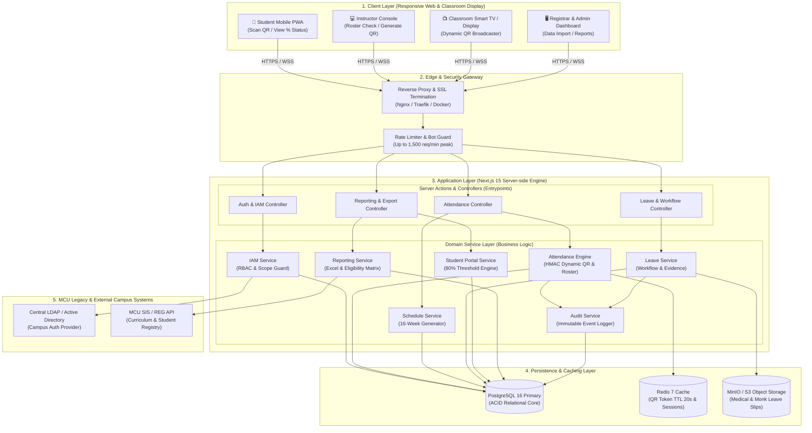
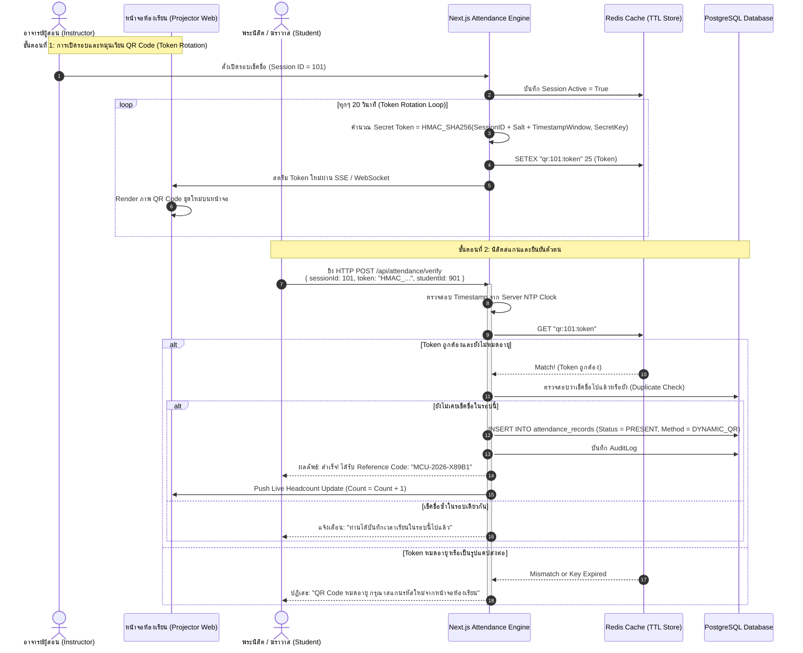

# System Architecture & Technical Blueprint
## โครงการ: ระบบเช็คชื่อ มหาวิทยาลัยมหาจุฬาลงกรณราชวิทยาลัย (MCU Smart Attendance System)
**เวอร์ชัน:** 1.0.0 (MVP)  
**สถาปัตยกรรม:** Modular Monolith on Next.js 15 (App Router) & Clean Architecture  
**เป้าหมาย:** ออกแบบสำหรับทีมพัฒนา Vibe Coding (AI-Native Engineering) มี Type-Safety สูง, Scalable, และ Zero-Lock-in

---

## 1. Monorepo / Directory Layout

ระบบถูกจัดโครงสร้างเป็น **Modular Monolith** อยู่ในโครงสร้างโฟลเดอร์เดียวเพื่อลดความซับซ้อนของ Tooling ในช่วง Vibe Coding แต่แยกขอบเขตของโมดูล (Domain Boundaries) ชัดเจนระดับ Service Layer:

```text
mcu-attendance/
├── .github/                      # CI/CD Workflows (GitHub Actions)
├── docs/                         # เอกสารประกอบการออกแบบและคู่มือระบบ
│   ├── 01_MVP_PainPoints...
│   ├── 02_System_Architecture...
│   └── 03_Documentation_Memory...
├── prisma/                       # Database Schema & Migrations
│   ├── schema.prisma             # Primary Prisma Data Model
│   ├── seed.ts                   # Initial Seed Data (Campuses, Faculties, Admin)
│   └── migrations/               # SQL Migration History
├── public/                       # Static Assets (Logos, Icons, Audio feedback)
├── src/
│   ├── app/                      # Next.js 15 App Router (Presentation & Routing)
│   │   ├── (auth)/               # Auth Group: /login, /forgot-password
│   │   ├── (dashboard)/          # Protected Group with Layout Wrapper
│   │   │   ├── student/          # /student/portal, /student/leave, /student/scan
│   │   │   ├── instructor/       # /instructor/courses, /instructor/sessions, /instructor/roster
│   │   │   ├── registrar/        # /registrar/import, /registrar/reports, /registrar/eligibility
│   │   │   └── admin/            # /admin/users, /admin/campuses, /admin/audit-logs
│   │   ├── api/                  # API Route Handlers (SSE, Webhooks, Public endpoints)
│   │   │   ├── attendance/qr/    # Streaming Dynamic QR Code SSE endpoint
│   │   │   ├── health/           # Container Liveness & Readiness Probe
│   │   │   └── webhooks/         # Integration Ingest Endpoints
│   │   ├── layout.tsx            # Root Layout with Font & Theme Providers
│   │   └── page.tsx              # Landing / Redirect Page
│   ├── components/               # UI Components
│   │   ├── ui/                   # Primitive UI (shadcn/ui: button, dialog, table, badge)
│   │   ├── shared/               # Shared Components (Navbar, Sidebar, UserAvatar, BuddhistDate)
│   │   ├── student/              # Student-specific Components (AttendanceCard, ScannerModal)
│   │   └── instructor/           # Instructor-specific Components (QRDisplay, RosterTable)
│   ├── lib/                      # Core Infrastructure & Utilities
│   │   ├── auth/                 # Auth.js Config, Session Helpers, RBAC Middleware
│   │   ├── db/                   # Prisma Client Singleton (`db.ts`)
│   │   ├── redis/                # Redis Client & Token Store (`redis.ts`)
│   │   ├── storage/              # MinIO / S3 Client for Uploading Evidence
│   │   ├── time/                 # Buddhist Era Formatter & NTP Server Clock
│   │   └── utils.ts              # Styling helpers (clsx, twMerge)
│   ├── modules/                  # Core Business Domain Services (Clean Architecture)
│   │   ├── iam/                  # MOD-01: IAM & User Management Service
│   │   ├── scheduling/           # MOD-02: Course, Term & Session Management
│   │   ├── attendance/           # MOD-03: Dual-Engine Verification & Anti-Cheat
│   │   ├── leave/                # MOD-04: Leave Workflow & Document Handling
│   │   ├── student/              # MOD-05: Attendance Aggregation & 80% Rule Calc
│   │   ├── reporting/            # MOD-06: Exam Eligibility & Excel Generator
│   │   └── audit/                # Centralized Immutable Audit Logger
│   ├── server-actions/           # Next.js Server Actions (Controller Entrypoints)
│   │   ├── auth.actions.ts
│   │   ├── attendance.actions.ts
│   │   ├── leave.actions.ts
│   │   └── course.actions.ts
│   └── types/                    # Global TypeScript Types & DTO Schemas
│       ├── auth.types.ts
│       ├── attendance.types.ts
│       └── report.types.ts
├── .env.example                  # Environment Variables Template
├── docker-compose.yml            # Local/Production Multi-Container Definition
├── Dockerfile                    # Multi-stage Production Build for Next.js
├── package.json
├── tailwind.config.ts
└── tsconfig.json
```

---

## 2. Mermaid Diagrams

### 2.1 Layered Architecture Diagram (Mermaid graph TB)



### 2.2 Dynamic QR Code Lifecycle & Verification Sequence



---

## 3. Technology Stack Table

| Layer | Technology | Version | Rationale & Enterprise Fit | License |
| :--- | :--- | :--- | :--- | :--- |
| **Framework** | **Next.js** | 15.x (App Router) | Fullstack React ในตัวเดียว รองรับ Server Actions, Server-Side Rendering (SSR) ป้องกันปัญหา SEO/Auth Leakage | MIT |
| **Language** | **TypeScript** | 5.x | End-to-end Type Safety ตั้งแต่ DB Schema ถึง Frontend Component ลดปัญหา Runtime Type Error สำหรับ Vibe Coding | Apache 2.0 |
| **UI System** | **Tailwind CSS + shadcn/ui** | Latest | Design System ระดับมืออาชีพ ปรับแต่ง Theme และโทนสีสุภาพสำหรับมหาวิทยาลัยสงฆ์ได้ง่าย มี Accessibility (a11y) ในตัว | MIT |
| **State & Forms** | **React Hook Form + Zod** | Latest | จัดการฟอร์มแบบ Zero Re-render พร้อม Schema Validation ชุดเดียวกันทั้งฝั่ง Client และ Server | MIT |
| **ORM** | **Prisma ORM** | 6.x | Schema ชัดเจน AI Tooling สร้างโค้ดได้แม่นยำสูง มี Migration Engine ที่ปลอดภัย | Apache 2.0 |
| **Database** | **PostgreSQL** | 16.x | ระบบฐานข้อมูลเชิงสัมพันธ์มาตรฐานสากล รองรับ ACID Transactions, Composite Indexing, และฟิลด์ JSONB สำหรับ Audit Log | PostgreSQL |
| **In-Memory Cache** | **Redis** | 7.x | ทำ In-memory Caching สำหรับ Dynamic QR Token (TTL 20 วินาที) และจัดคิว Rate Limiting รองรับ Peak Load เช้า | BSD 3-Clause |
| **Object Storage** | **MinIO (Self-hosted)** | Latest | สำหรับเก็บเอกสารใบรับรองแพทย์และใบฎีกานิมนต์ รองรับ S3 API ติดตั้งฟรีบน On-Premise มจร | AGPLv3 / Apache 2.0 |
| **Authentication** | **Auth.js (NextAuth)** | 5.x | รองรับ Stateless JWT Strategy และสามารถต่อขยาย LDAP/OAuth2 SSO ของ มจร ได้อย่างราบรื่น | ISC |
| **Container Engine**| **Docker & Compose** | Latest | บรรจุแพ็กเกจทุก Service ให้อยู่ใน Container เพื่อความง่ายในการ Deployment บนเซิร์ฟเวอร์ มจร ส่วนกลาง | Apache 2.0 |

---

## 4. API & Communication Patterns

### 4.1 Server Actions vs Route Handlers
* **Next.js Server Actions (`/src/server-actions/`):** ใช้สำหรับการทำ **Data Mutation** และฟอร์มทั้งหมด (เช่น บันทึกเช็คชื่อ, ยื่นใบลา, สร้างตารางสอน, แก้ไขสถานะ)
  * *ข้อดี:* มี Type-Safe ส่งผ่าน Data Schema ด้วย Zod โดยตรง ป้องกัน CSRF อัตโนมัติ ไม่ต้องเขียน boilerplate fetcher
* **Route Handlers (`/src/app/api/`):** ใช้สำหรับกรณีเฉพาะ:
  * `GET /api/attendance/qr/stream`: ใช้ Server-Sent Events (SSE) ในการสตรีม QR Code ไปยังหน้าจอโปรเจกเตอร์
  * `GET /api/health`: Health Check สำหรับ Docker/Kubernetes Liveness Probe
  * `POST /api/webhooks/sis`: จุดรับซิงก์ข้อมูลจากระบบทะเบียนภายนอก

### 4.2 Standard API Response & Error Handling Format
ทุก Server Action และ API Response ต้องส่งผลลัพธ์ในรูปแบบ Generic Envelope:

```typescript
export interface ApiResponse<T = any> {
  success: boolean;
  data?: T;
  error?: {
    code: string;       // เช่น "QR_EXPIRED", "UNAUTHORIZED", "ALREADY_CHECKED_IN"
    message: string;    // ข้อความภาษาไทยสำหรับแสดงผลแก่ผู้ใช้งาน
    details?: any;
  };
  timestamp: string;    // Server ISO Timestamp (UTC+7)
}
```

### 4.3 Validation Strategy ด้วย Zod
ข้อมูล Input ทุกชนิดต้องถูก Validate ผ่าน Zod Schema ก่อนถึง Service Layer เสมอ ตัวอย่าง:

```typescript
export const CheckInPayloadSchema = z.object({
  sessionId: z.string().uuid(),
  token: z.string().min(16),
  deviceFingerprint: z.string().optional(),
});
export type CheckInPayload = z.infer<typeof CheckInPayloadSchema>;
```

---

## 5. Security & Compliance Architecture

1. **Role-Based Access Control (RBAC):**
   * ควบคุมผ่าน Next.js Middleware (`/src/middleware.ts`) ตรวจสอบ JWT Claims ก่อนอนุญาตให้เรนเดอร์หน้าจอ
   * เสริมด้วย Method-Level Guard ใน Domain Service Layer เพื่อป้องกันกรณี Client พยายามเรียก Server Action ข้ามบทบาท
2. **Anti-Replay Attack Dynamic QR:**
   * QR Token แต่ละชุดมีอายุ 20 วินาทีบวกระยะผ่อนผัน 5 วินาทีสำหรับ Network Latency (รวม TTL = 25 วินาที)
   * บันทึก Token ที่ถูกใช้งานแล้ว (Used Tokens) ใน Redis เพื่อป้องกันการนำ Token เดิมมา Replay ยิงซ้ำในเสี้ยววินาที
3. **Server Clock Authority (NTP Sync):**
   * เซิร์ฟเวอร์ของระบบเช็คชื่อ มจร ต้องซิงก์เวลากับ NTP Server ของสถาบันมาตรวิทยาแห่งชาติ หรือ Server กลางของ มจร อย่างสม่ำเสมอ ความคลาดเคลื่อนต้องไม่เกิน $\pm 500$ มิลลิวินาที
4. **Data Privacy (PDPA Compliance):**
   * จัดเก็บเฉพาะข้อมูลที่จำเป็นต่อการจัดการศึกษา (Data Minimization)
   * ไฟล์ภาพหลักฐานการลา (ใบรับรองแพทย์/ใบฎีกา) จะถูกเข้ารหัสชื่อไฟล์แบบ UUID และอนุญาตให้เข้าถึงได้เฉพาะอาจารย์ผู้สอนวิชานั้นและเจ้าหน้าที่ทะเบียนผ่าน Pre-signed URL ที่มีอายุจำกัด (15 นาที) เท่านั้น

---

## 6. Resilience & Fallback Architecture

| กรณีความล้มเหลว (Failure Mode) | กลยุทธ์การฟื้นตัวและทำงานต่อเนื่อง (Fallback Strategy) |
| :--- | :--- |
| **ระบบกลาง LDAP / SSO มจร ล่ม** | ระบบใช้ **Stateless Long-lived JWT** บนเบราว์เซอร์ของผู้ใช้ (อายุ 7 วัน) จึงไม่ได้รับผลกระทบ สำหรับอาจารย์ใหม่หรือกรณีฉุกเฉิน มี **Emergency Local Staff PIN** ที่เข้ารหัสระดับ Argon2 ในฐานข้อมูลของระบบเช็คชื่อเอง |
| **ระบบทะเบียนกลาง (SIS) ขัดข้อง** | ระบบเช็คชื่อทำงานบน **Local PostgreSQL Shadow Database** ไม่พึ่งพาการดึงข้อมูลสดจาก SIS ระหว่างเรียน สามารถนำเข้าตารางเรียนผ่าน Excel ทดแทนได้ทันที และผลเวลาเรียนจะถูกพักไว้ในตาราง Outbox เพื่อรอซิงก์กลับ SIS เมื่อระบบทะเบียนเปิดทำการ |
| **อินเทอร์เน็ตในห้องเรียน/วัด ล่ม** | อาจารย์สามารถสลับเข้าสู่โหมด **Manual Roster Check-in** ผ่านเครื่องของผู้สอนเพียงเครื่องเดียว (หรือเปิด Hotspot มือถือ) หรือใช้ใบพิมพ์รายชื่อกระดาษประจำคาบที่ระบบสร้างไว้ล่วงหน้าเพื่อให้นิสิตเซ็นชื่อ แล้วนำมาบันทึกย้อนหลัง |
| **Redis Cache ดับ** | ระบบมีโหมด Fallback สลับไปใช้ Local In-Memory Cache (LRU Cache บน Node.js Process) สำหรับการคำนวณ Dynamic QR ชั่วคราว โดยระบบจะบันทึก Warning ไปยังศูนย์คอมพิวเตอร์เพื่อรีสตาร์ต Redis Container |
