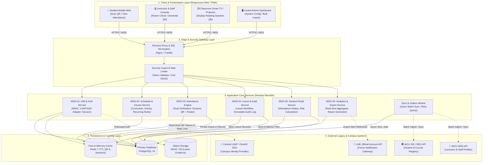
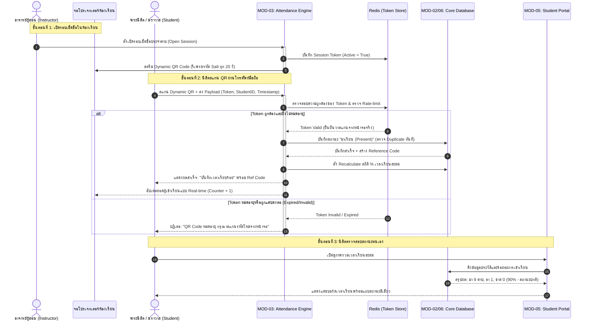
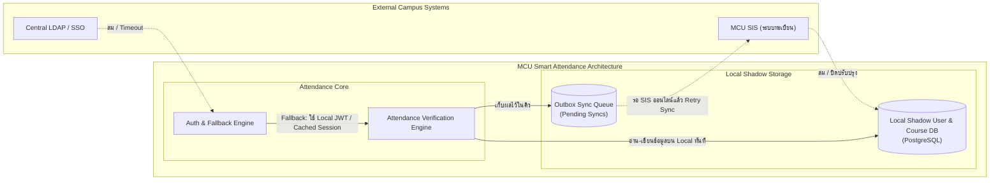

# เอกสารออกแบบสถาปัตยกรรมระบบและข้อกำหนดฟีเจอร์ MVP (System Architecture & Feature Specs)
**โครงการ:** ระบบเช็คชื่อ มจร (MCU Smart Attendance System)  
**บทบาท:** Principal Solution Architect & CTO Advisor  
**เทคนิคพัฒนา:** Vibe Coding (AI-Native Engineering) | **ระยะเวลา MVP:** 6–9 เดือน

---

## 1. Architecture & Data Interaction Flow

### 1.1 Layered Architecture Diagram (Mermaid graph TB)
ระบบถูกออกแบบตามสถาปัตยกรรม **Modular Monolith บน Next.js Fullstack & Clean Architecture** เพื่อตอบโจทย์ทีมพัฒนาสาย *Vibe Coding* ที่เน้นความคล่องตัวสูง (High Velocity), โค้ดที่ AI เข้าใจและ Generate ได้แม่นยำ (High Cohesion, Low Coupling), และง่ายต่อการบำรุงรักษาโดยบุคลากรไอทีของมหาวิทยาลัย

---

### 1.2 Cross-Module Event / Data Flow Sequence
ลำดับการทำงานเมื่ออาจารย์เปิดรอบเช็คชื่อ $\rightarrow$ นิสิตสแกน Dynamic QR $\rightarrow$ บันทึกข้อมูลและอัปเดตสถิติร้อยละเวลาเรียนสะสม

---

### 1.3 Technology Stack Table
คัดเลือกเทคโนโลยีที่สอดคล้องกับแนวทาง **Vibe Coding** (AI สร้างโค้ดได้รวดเร็ว Type-safe สูง เอกสารสมบูรณ์) และมีลิขสิทธิ์ Open Source ที่มหาวิทยาลัยใช้งานได้ฟรีตลอดชีพ

| Layer | Technology | Key Capabilities & Rationale for Vibe Coding | License |
| :--- | :--- | :--- | :--- |
| **Frontend UI** | **Next.js 15 (App Router) + Tailwind CSS + shadcn/ui** | • AI Tooling เข้าใจ Next.js และ shadcn/ui สูงมาก สร้าง UI ได้เร็วและสวยงามระดับ Enterprise • Fully Responsive ใช้งานได้ลื่นไหลทั้งมือถือ แท็บเล็ต และคอมพิวเตอร์ • มี Component พร้อมใช้ ลดการเขียน CSS แบบดั้งเดิม | MIT License |
| **Application Layer** | **Node.js 22 LTS / TypeScript** | • Single Language (Fullstack TypeScript) ช่วยให้ AI บริบทไม่หลุด ทำงานร่วมกันทั้งหน้าบ้านและหลังบ้าน • มี Ecosystem ใหญ่ที่สุดในโลก รองรับการต่อยอดในอนาคต | MIT License |
| **ORM & Schema** | **Prisma ORM** | • มี Type-safe Data Client ช่วยป้องกัน Bug ข้อมูลตั้งแต่ช่วงพัฒนา • สคีมา (Schema DSL) ชัดเจน ทำให้ AI เข้าใจความสัมพันธ์ของฐานข้อมูลได้แม่นยำ 100% | Apache 2.0 |
| **Cache & Real-time** | **Redis 7 (In-Memory)** | • จัดเก็บ Dynamic QR Code Token ที่มีอายุสั้น (TTL 15-30 วิ) • รองรับ Rate Limiting ป้องกันการส่งสแปมสแกนรัวๆ • รองรับ Pub/Sub สำหรับ Live Counter บนหน้าจอโปรเจกเตอร์ | BSD 3-Clause |
| **Primary Database** | **PostgreSQL 16** | • มาตรฐานฐานข้อมูล Relational ที่น่าเชื่อถือที่สุด มีระบบ Transaction และ ACID สูง • รองรับ JSONB สำหรับจัดเก็บ Audit Log และยืดหยุ่นต่อการขยายฟิลด์ในอนาคต | PostgreSQL License |
| **Object Storage** | **MinIO (Self-hosted) / S3-compatible** | • จัดเก็บไฟล์ภาพหลักฐานการลา (ใบรับรองแพทย์, ใบฎีกานิมนต์) • สามารถติดตั้งบนเซิร์ฟเวอร์ใน มจร ได้ทันที ไม่ต้องเสียค่าใช้จ่าย Cloud | GNU AGPLv3 / Apache 2.0 |
| **Auth & Security** | **Auth.js (NextAuth) + LDAP Adapter** | • รองรับทั้งการยืนยันตัวตนผ่าน Campus LDAP/SSO ของ มจร และระบบ Internal Local JWT สำรอง | ISC License |
| **DevOps & Deploy** | **Docker & Docker Compose** | • บรรจุระบบทั้งหมดเป็น Container ทำให้ติดตั้ง (Deploy) บนเซิร์ฟเวอร์ On-Premise หรือ Cloud ของ มจร ได้ภายในคำสั่งเดียว | Apache 2.0 |

---

## 2. MVP Feature Specifications (MoSCoW Framework)

### 2.1 รายการฟีเจอร์แยกตามโมดูล (Feature Breakdown)

| Feature ID | Feature Name | User Story (มุมมองผู้ใช้งาน) | MoSCoW Priority |
| :--- | :--- | :--- | :---: |
| **MOD-01: Identity & Access Management (IAM)** |
| F-01-01 | Role-Based Access Control | ในฐานะ **ผู้ดูแลระบบ** ฉันต้องการกำหนดสิทธิ์ตามบทบาท (นิสิต, อาจารย์, เจ้าหน้าที่, Admin) เพื่อจำกัดการเข้าถึงข้อมูลตามขอบเขตหน้าที่ | **Must Have** |
| F-01-02 | Bulk User Import (CSV/Excel) | ในฐานะ **เจ้าหน้าที่ทะเบียน** ฉันต้องการอัปโหลดรายชื่อนิสิตและคณาจารย์จากไฟล์ Excel พร้อมตรวจข้อมูลซ้ำ เพื่อประหยัดเวลาเริ่มเปิดเทอม | **Must Have** |
| F-01-03 | Dual Identity Support | ในฐานะ **ระบบ** ฉันต้องการแยกประเภทผู้ใช้เป็น "บรรพชิต" (พระ/เณร) และ "ฆราวาส" พร้อมระบุฉายา/นามสกุล เพื่อให้การแสดงผลถูกสมณสารูป | **Must Have** |
| F-01-04 | Campus & Faculty Scoping | ในฐานะ **เจ้าหน้าที่วิทยาเขต** ฉันต้องการดูและจัดการเฉพาะข้อมูลนิสิตในวิทยาเขตของตนเอง เพื่อความปลอดภัยของข้อมูลข้ามหน่วยงาน | **Should Have** |
| **MOD-02: Course & Activity Scheduling** |
| F-02-01 | Create Course & Activity | ในฐานะ **ผู้สอน/ผู้จัด** ฉันต้องการสร้างรายวิชาและกิจกรรมพิเศษ (เช่น ปฏิบัติธรรม) พร้อมระบุห้อง วัน และเวลา เพื่อเปิดรอบเช็คชื่อ | **Must Have** |
| F-02-02 | Recurring Schedule Clone | ในฐานะ **ผู้สอน** ฉันต้องการคัดลอกตารางสอนประจำสัปดาห์ตลอดทั้งเทอม (16 สัปดาห์) ได้ในคลิกเดียว เพื่อไม่ต้องสร้างใหม่ทุกคาบ | **Must Have** |
| F-02-03 | Multi-Session Check-in | ในฐานะ **ผู้จัดงานปฏิบัติธรรม** ฉันต้องการแบ่งรอบเช็คชื่อ เช้า–บ่าย–ค่ำ ในวันเดียวกัน เพื่อสรุปเวลาร่วมวัตรปฏิบัติได้ครบถ้วน | **Must Have** |
| F-02-04 | Flexible Time Rules | ในฐานะ **ผู้สอน** ฉันต้องการตั้งเกณฑ์เวลา "สาย" (เช่น หลังเริ่ม 15 นาที) และเวลา "ปิดรับ" เพื่อให้สอดคล้องกับข้อตกลงในชั้นเรียน | **Must Have** |
| **MOD-03: Dual-Engine Attendance Verification** |
| F-03-01 | Dynamic Rotating QR Code | ในฐานะ **ผู้สอน** ฉันต้องการเปิด QR Code บนหน้าจอที่รหัสเปลี่ยนทุก 20 วินาที เพื่อป้องกันไม่ให้นิสิตแคปรูปส่งไปให้เพื่อนเช็คแทน | **Must Have** |
| F-03-02 | Mobile QR Scan & Confirmation | ในฐานะ **นิสิต** ฉันต้องการเปิดเว็บสแกน QR ได้ง่ายผ่านกล้องมือถือ และได้รับเลขอ้างอิงยืนยันทันที เพื่อเป็นหลักฐานว่าตนเองเช็คชื่อสำเร็จ | **Must Have** |
| F-03-03 | Manual Roster Check-in | ในฐานะ **ผู้สอน/พระพี่เลี้ยง** ฉันต้องการค้นหารายชื่อและคลิกบันทึก มา/สาย/ขาด ได้โดยตรง เพื่อเป็นทางเลือกสำรองเมื่อนิสิตไม่มีมือถือหรือเน็ตหลุด | **Must Have** |
| F-03-04 | Real-time Headcount Counter | ในฐานะ **ผู้สอน** ฉันต้องการเห็นจำนวนคนที่เช็คชื่อแล้วอัปเดตแบบสดๆ บนจอโปรเจกเตอร์ เพื่อทราบความพร้อมก่อนเริ่มสอน | **Should Have** |
| F-03-05 | Batch Status Override | ในฐานะ **ผู้สอน** ฉันต้องการเลือกเปลี่ยนสถานะนิสิตพร้อมกันหลายคน (เช่น ปรับกลุ่มที่มาสายเป็นมาปกติ) เพื่อความรวดเร็วในการจัดการ | **Should Have** |
| **MOD-04: Leave Request & Audit Workflow** |
| F-04-01 | Leave Submission & Evidence | ในฐานะ **พระนิสิต/นิสิต** ฉันต้องการยื่นใบลา (ลาป่วย, ลากิจ, ติดกิจนิมนต์) พร้อมแนบภาพหลักฐานผ่านมือถือ เพื่อขออนุญาตหยุดเรียนล่วงหน้า | **Should Have** |
| F-04-02 | Lecturer Approval Flow | ในฐานะ **ผู้สอน** ฉันต้องการดูรายการขอลารายวิชาตนเอง และกด "อนุมัติ" หรือ "ปฏิเสธ" พร้อมใส่เหตุผลได้ทันที | **Should Have** |
| F-04-03 | Immutable Audit Trail | ในฐานะ **ผู้บริหาร/นิติการ** ฉันต้องการดูบันทึกย้อนหลังว่าใครเป็นผู้แก้ไขสถานะเวลาเรียน วันเวลาใด และเหตุผลอะไร เพื่อความโปร่งใส | **Should Have** |
| **MOD-05: Real-time Student Portal** |
| F-05-01 | Self-Attendance Dashboard | ในฐานะ **นิสิต** ฉันต้องการดูสถิติเวลาเรียนรวมรายวิชา (มา สาย ขาด ลา) และร้อยละเวลาเรียนสะสม (% Attendance) เพื่อประเมินตนเอง | **Must Have** |
| F-05-02 | 80% Threshold Early Warning | ในฐานะ **นิสิต** ฉันต้องการเห็นแถบสีแจ้งเตือนทันทีเมื่อเวลาเรียนใกล้จะต่ำกว่า 80% เพื่อจะได้ระวังตัวไม่ให้หมดสิทธิ์สอบ | **Must Have** |
| F-05-03 | Attendance Slip / History | ในฐานะ **นิสิต** ฉันต้องการดูประวัติการเช็คชื่อย้อนหลังพร้อมเวลาที่บันทึก เพื่อใช้ทบทวนกรณีมีข้อสงสัยเรื่องเวลาเรียน | **Must Have** |
| **MOD-06: Analytics & Compliance Reporting** |
| F-06-01 | Exam Eligibility Report | ในฐานะ **ฝ่ายทะเบียนและประเมินผล** ฉันต้องการระบบตัดยอดและแสดงรายชื่อ "ผู้มีสิทธิ์สอบ" และ "ผู้หมดสิทธิ์สอบ" อัตโนมัติตามเกณฑ์ 80% | **Must Have** |
| F-06-02 | Excel/CSV Data Export | ในฐานะ **เจ้าหน้าที่/ผู้สอน** ฉันต้องการส่งออกรายงานการเข้าเรียนเป็นไฟล์ Excel ตามฟอร์แมตของมหาวิทยาลัยได้ในคลิกเดียว | **Must Have** |
| F-06-03 | Printable Attendance Sheet | ในฐานะ **ผู้สอน** ฉันต้องการพิมพ์ใบสรุปเวลาเรียนพร้อมช่องลงลายมือชื่อ เพื่อเก็บเข้าแฟ้มหลักฐานการประกันคุณภาพ (AUN-QA) | **Must Have** |
| F-06-04 | Executive Summary Dashboard | ในฐานะ **คณบดี/ผู้บริหาร** ฉันต้องการดูแดชบอร์ดภาพรวมอัตราการเข้าเรียนเฉลี่ยแยกตามคณะและภาควิชา เพื่อใช้ตัดสินใจเชิงบริหาร | **Could Have** |

---

### 2.2 Non-Functional Requirements (NFR)

| หมวดหมู่ (Category) | ข้อกำหนด (Specification) | เกณฑ์ชี้วัด (Target Metrics) |
| :--- | :--- | :--- |
| **Performance & Peak Load** | รองรับการสแกนเช็คชื่อพร้อมกันในช่วง Peak Period (เช่น 08:15–08:30 น. ก่อนเข้าเรียน) | • รองรับอย่างน้อย **1,500 Requests/Minute** • Response Time สำหรับการสแกนและยืนยันผล **< 1.0 วินาที** (P95) |
| **Availability & Uptime** | ความพร้อมใช้งานของระบบในวันและเวลาทำการของมหาวิทยาลัย | • Service Availability **$\ge$ 99.5%** ตลอดภาคการศึกษา • มีระบบ Health Check อัตโนมัติและ Auto-restart Container |
| **Data Integrity & Anti-Fraud** | ป้องกันการทุจริตและการวนใช้รหัสซ้ำ | • Dynamic QR Code มีอายุไม่เกิน 30 วินาที (Zero Replay Attack) • ใช้เวลาอ้างอิงจาก Server NTP Time ไม่ใช้เวลาของเครื่องผู้ใช้งาน |
| **Usability & Accessibility** | รองรับผู้ใช้งานทุกกลุ่มอย่างเท่าเทียม (Inclusive Design) | • รองรับ WCAG 2.1 Level AA (Contrast สีอ่านง่าย ตัวอักษรปรับขยายได้) • รองรับ Mobile First ทุกเบราว์เซอร์มาตรฐาน (Safari, Chrome, Line Browser) |
| **Security & PDPA Compliance** | ความมั่นคงปลอดภัยและการคุ้มครองข้อมูลส่วนบุคคล | • ข้อมูลส่งผ่าน HTTPS (TLS 1.3) • มี RBAC ควบคุมการดูข้อมูลข้ามสิทธิ์ และเก็บบันทึกการแก้ไข (Audit Log) อย่างน้อย 5 ปี |

---

## 3. Resilience & Fallback Strategy (กลยุทธ์การทำงานต่อเนื่องเมื่อระบบภายนอกขัดข้อง)

ในสภาพแวดล้อมสถาบันการศึกษา ระบบดั้งเดิม (Legacy Systems) เช่น SIS (ระบบทะเบียน), HRIS (ระบบบุคคล) หรือ LDAP มักประสบปัญหาการปิดปรับปรุงหรือ Downtime กะทันหัน เพื่อให้ระบบเช็คชื่อ มจร ทำงานได้ **100% ตลอดเวลา (Zero-Disruption)** จึงวางแผนสถาปัตยกรรมความต่อเนื่องไว้ดังนี้:

### 3.1 กรณีระบบยืนยันตัวตนกลาง (Central LDAP / SSO) ล่ม
* **ผลกระทบ:** นิสิตและอาจารย์ไม่สามารถล็อกอินผ่านบัญชีกลางของมหาวิทยาลัยได้
* **Fallback Strategy (กลยุทธ์รับมือ):**
  1. **Long-lived Session Token:** สำหรับผู้ที่เคยเข้าสู่ระบบแล้ว ระบบจะใช้ Refresh Token / JWT ที่ปลอดภัยบนเครื่องผู้ใช้ ทำให้เซสชันยังคงใช้งานได้ต่อเนื่อง 7–14 วันโดยไม่ต้องล็อกอินใหม่ทุกเช้า
  2. **Emergency PIN / Local Credential:** สำหรับผู้สอนและเจ้าหน้าที่ ระบบจะมีรหัสสำรอง (Staff Emergency PIN) ที่เข้ารหัสแบบ Argon2 ในฐานข้อมูลท้องถิ่น เพื่อให้อาจารย์สามารถล็อกอินเปิดห้องเรียนและเช็คชื่อแทนได้ทันทีแม้ LDAP จะดับทั้งมหาวิทยาลัย

### 3.2 กรณีระบบทะเบียนกลาง (MCU SIS / REG) ล่มหรือไม่พร้อมเชื่อมต่อ
* **ผลกระทบ:** ไม่สามารถดึงรายชื่อนิสิตหรือรายวิชาใหม่จากฐานข้อมูลกลางได้
* **Fallback Strategy (กลยุทธ์รับมือ):**
  1. **Decoupled Shadow Database (สถาปัตยกรรมตัดขาดการพึ่งพาตรง):** ระบบเช็คชื่อจะไม่ดึงข้อมูลจาก SIS แบบ Synchronous ในจังหวะที่นิสิตกำลังสแกนเช็คชื่อ แต่จะใช้ **Shadow Tables** ภายใน PostgreSQL ของระบบเช็คชื่อเอง ซึ่งมีการซิงก์ข้อมูลนักศึกษาและตารางสอนแบบ Batch Job ล่วงหน้า
  2. **Manual Excel Ingest as Bypass:** หาก SIS ล่มเป็นเวลานาน เจ้าหน้าที่ทะเบียนสามารถนำเข้าข้อมูลรายวิชาและนิสิตผ่านไฟล์ Excel เข้าสู่ระบบเช็คชื่อได้โดยตรง ระบบสามารถเริ่มภาคการศึกษาได้ทันทีโดยไม่ต้องรอให้ฝ่ายไอทีกลางกู้ระบบ SIS สำเร็จ
  3. **Transactional Outbox Pattern:** เมื่อเช็คชื่อเสร็จสิ้น ข้อมูลผลการเข้าเรียนจะถูกเก็บไว้ในฐานข้อมูลท้องถิ่นก่อน จากนั้น Worker จะรอจังหวะที่ SIS กลับมาออนไลน์ แล้วทำการส่งคะแนน/เวลาเรียนกลับเข้าสู่ระบบทะเบียนแบบอัตโนมัติพร้อมระบบ Exponential Backoff Retry

### 3.3 กรณีสัญญาณอินเทอร์เน็ตในห้องเรียนหรือสถานที่ปฏิบัติธรรมขัดข้อง
* **ผลกระทบ:** นิสิตไม่สามารถเชื่อมต่ออินเทอร์เน็ตเพื่อสแกน Dynamic QR Code ได้
* **Fallback Strategy (กลยุทธ์รับมือ):**
  1. **Instant Switch to Manual Roster Mode:** อาจารย์หรือพระพี่เลี้ยงสามารถสลับหน้าจอไปที่โหมด "เช็คชื่อรายบุคคล (Roster Mode)" โดยผู้สอนใช้สัญญาณอินเทอร์เน็ตจากเครื่องตนเองเพียงเครื่องเดียวในการทำเครื่องหมายเช็คชื่อแทนผู้เรียน
  2. **Printable Attendance Roster (Zero-Tech Plan):** อาจารย์สามารถดาวน์โหลดหรือพิมพ์ "ใบรายชื่อกระดาษประจำคาบ" ที่จัดเรียงตามลำดับรหัสนิสิตเตรียมไว้ล่วงหน้าเพื่อให้นิสิตเซ็นชื่อ จากนั้นเจ้าหน้าที่สามารถนำมาสแกนหรือติ๊กอัปเดตย้อนหลังในระบบได้ภายในไม่กี่นาที
