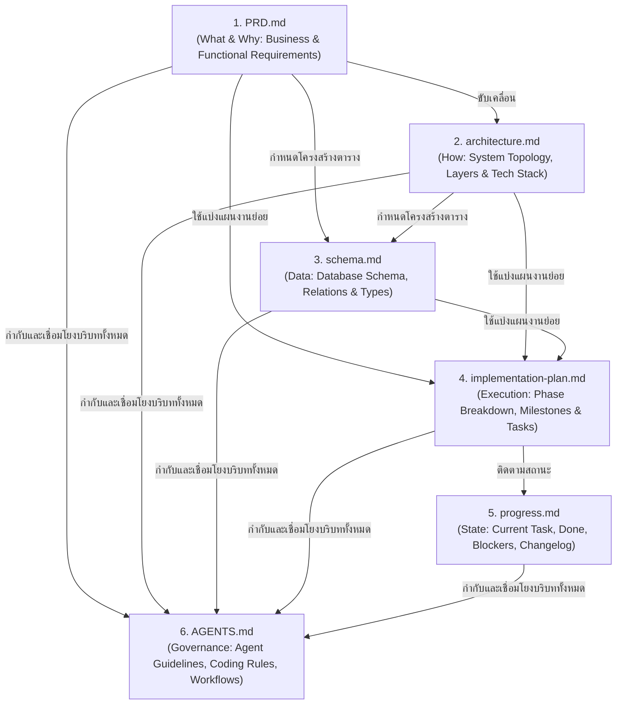

# แผนการสกัดและสร้างชุดเอกสาร Documentation Memory สำหรับกระบวนการ Vibe Coding
**โครงการ:** ระบบเช็คชื่อ มจร (MCU Smart Attendance System)  
**บทบาท:** Technical Project Lead & AI Governance Engineer  
**แนวทางการพัฒนา:** AI-Assisted Rapid Engineering (Vibe Coding with Living Memory)

---

## 1. ลำดับการสร้างชุดเอกสารตาม Dependency Order (ลำดับพึ่งพาทางตรรกะ)

การสร้างชุดเอกสาร Documentation Memory สำหรับให้ AI Agents ทำงานได้อย่างแม่นยำ ไม่หลุดบริบท และไม่เกิด Code Hallucination จะต้องเรียงตามลำดับจาก **"ระดับธุรกิจ $\rightarrow$ โครงสร้างระบบ $\rightarrow$ แบบจำลองข้อมูล $\rightarrow$ แผนงานปฏิบัติ $\rightarrow$ สถานะงาน $\rightarrow$ กฎเกณฑ์กำกับดูแล AI"** ดังนี้:

### Rationale ของแต่ละลำดับ:
1. **PRD.md (ต้องมีเป็นไฟล์แรก):** นิยามขอบเขตฟังก์ชัน (Scope), ผู้ใช้งาน (Roles), และเกณฑ์ความสำเร็จ (Acceptance Criteria) หากไม่มีไฟล์นี้ AI จะเขียนสถาปัตยกรรมที่เกินหรือขาดขอบเขต
2. **architecture.md (ไฟล์ที่ 2):** แปลงความต้องการจาก PRD เป็นโครงสร้างทางเทคนิค Component Boundaries, การสื่อสารระหว่างเซอร์วิส, และแนวทางการเชื่อมต่อระบบภายนอก
3. **schema.md (ไฟล์ที่ 3):** เมื่อรู้ Functional Flow และ Architecture แล้ว จึงสามารถออกแบบ Entity Relationship Diagram (ERD), Data Types, และ Constraints ในระดับลึกได้อย่างถูกต้องโดยไม่ต้องรื้อแก้บ่อย
4. **implementation-plan.md (ไฟล์ที่ 4):** นำ Features จาก PRD และ Data Model จาก Schema มาย่อยเป็น Actionable Tasks รายขั้นตอนแบบ Step-by-Step เพื่อให้ Agent พัฒนาทีละส่วนได้อย่างเป็นระบบ
5. **progress.md (ไฟล์ที่ 5):** เป็น Living Ledger บันทึกสถานะงานแบบ Real-time เพื่อให้ AI Agent รู้ว่าตอนนี้กำลังทำอะไร ทำอะไรเสร็จแล้ว และอะไรคืองานชิ้นถัดไปเมื่อมีการเปิด Session ใหม่
6. **AGENTS.md (ไฟล์ที่ 6 - หัวใจของการควบคุม AI):** สรุปสารบบเอกสารทั้งหมด กฎเกณฑ์การเขียนโค้ด (Coding Conventions), การรักษาความปลอดภัย, คำสั่งที่อนุญาตให้รัน และวิธีอ่าน Memory ทั้งหมด

---

## 2. โครงสร้าง Outline และ Checklist สำคัญของแต่ละไฟล์ (Document Outlines & Checklists)

### 2.1 PRD.md (Product Requirements Document)
* **วัตถุประสงค์:** แหล่งข้อมูลอ้างอิงหลักทางฟังก์ชันและธุรกิจ สำหรับให้ Agent อ่านเพื่อทำความเข้าใจพฤติกรรมของระบบ
* **หัวข้อสำคัญ (Outline):**
  1. Executive Summary & Problem Statements (Pain Points บริบท มจร)
  2. Target Personas (พระนิสิต, นิสิตฆราวาส, อาจารย์ผู้สอน, เจ้าหน้าที่ทะเบียน, ผู้บริหาร)
  3. Feature Specifications แยกตาม 6 Core Modules (User Stories & Acceptance Criteria)
  4. Core Business Rules (กฎการนับเวลาเรียน 80%, กฎการนับสาย, กิจนิมนต์/การลา)
  5. Out of Scope for MVP (ฟีเจอร์ที่ห้ามทำในระยะแรก เช่น Face Scan, Hardware RFID)
* **Checklist สำหรับ AI:**
  - [ ] ตรวจสอบว่ามี Acceptance Criteria แบบ Given-When-Then สำหรับทุก Feature หรือไม่
  - [ ] ระบุเงื่อนไขเฉพาะของมหาวิทยาลัยสงฆ์ (เช่น การแยกชื่อ-ฉายาพระภิกษุ) ครบถ้วนหรือไม่

### 2.2 architecture.md (System Architecture & Tech Blueprint)
* **วัตถุประสงค์:** แผนผังทางเทคนิค กำหนดว่าโค้ดแต่ละประเภทต้องวางไว้ที่โฟลเดอร์ใด และคุยกันอย่างไร
* **หัวข้อสำคัญ (Outline):**
  1. High-Level Architecture (Modular Monolith on Next.js 15 App Router)
  2. Directory & Package Structure (โฟลเดอร์สำหรับ UI, Server Actions, Services, Lib)
  3. Data Flow & Event Lifecycle (Dynamic QR Token TTL, Real-time Counter Flow)
  4. Security & Compliance Architecture (RBAC Guard, Session Strategy, Server Clock NTP)
  5. Fallback & Resilience Strategy (LDAP Down, SIS Down, Offline Roster Flow)
* **Checklist สำหรับ AI:**
  - [ ] ระบุชัดเจนว่า Business Logic ต้องอยู่ที่ Service Layer เท่านั้น ห้ามใส่ใน UI Components
  - [ ] กำหนด Interface การทำงานระหว่าง Client กับ Server อย่างชัดเจน

### 2.3 schema.md (Database & Domain Data Model)
* **วัตถุประสงค์:** นิยาม Data Schema ทุกตาราง ฟิลด์ ชนิดข้อมูล (Data Types) ความสัมพันธ์ และ Index
* **หัวข้อสำคัญ (Outline):**
  1. Entity Relationship Diagram (ERD) ในรูปแบบ Mermaid
  2. Data Dictionary & Prisma Schema Definition (Users, Roles, Courses, Schedules, Attendances, Leaves, AuditLogs)
  3. Enums Definition (Role, AttendanceStatus: PRESENT, LATE, ABSENT, LEAVE, EXCUSED)
  4. Indexing & Optimization Strategy (Index บน composite key: `[scheduleId, studentId]`, timestamp)
  5. Redis Key Patterns (เช่น `qr:session:{scheduleId}:token`, `rate:scan:{studentId}`)
* **Checklist สำหรับ AI:**
  - [ ] มี Unique Constraint ป้องกันการสแกนเช็คชื่อซ้ำในรอบเดียวกันหรือไม่
  - [ ] มีฟิลด์ Audit Log (createdBy, updatedBy, ipAddress, userAgent) ครบถ้วนหรือไม่

### 2.4 implementation-plan.md (Phased Execution Roadmap)
* **วัตถุประสงค์:** แผนงานย่อยที่แบ่งเป็น Phase และ Sprint Tasks พร้อมนิยาม Definition of Done (DoD)
* **หัวข้อสำคัญ (Outline):**
  1. Phase 1: Project Setup, Database Migration & Auth Core (MOD-01)
  2. Phase 2: Course & Schedule Management (MOD-02)
  3. Phase 3: Dual Attendance Engine (Dynamic QR & Roster) (MOD-03)
  4. Phase 4: Student Portal & Self-Monitoring Dashboard (MOD-05)
  5. Phase 5: Reporting, Risk Detection & Excel Export (MOD-06)
  6. Phase 6: Leave Request Workflow & Audit Trail (MOD-04)
  7. Definition of Done (DoD) ประจำแต่ละ Task
* **Checklist สำหรับ AI:**
  - [ ] งานแต่ละชิ้นย่อยพอที่จะให้ AI เขียนเสร็จใน 1 รอบการทำงานหรือไม่ (Micro-tasks)
  - [ ] มีขั้นตอน Verification Plan สำหรับตรวจสอบผลลัพธ์ของแต่ละ Task ชัดเจน

### 2.5 progress.md (Active State & Task Tracker)
* **วัตถุประสงค์:** Single Source of Truth สำหรับบอกสถานะของโปรเจกต์ ณ ปัจจุบัน
* **หัวข้อสำคัญ (Outline):**
  1. Current Sprint / Current Milestone Focus
  2. In-Progress Task (งานที่กำลังทำอยู่ขณะนี้)
  3. Completed Tasks (งานที่เสร็จแล้ว พร้อม Commit hash หรือไฟล์ที่สร้าง)
  4. Blockers & Technical Debt (ปัญหาติดขัดหรือข้อจำกัดที่รอการตัดสินใจ)
  5. Recent Changes / Changelog Log
* **Checklist สำหรับ AI:**
  - [ ] Agent ต้องทำการอัปเดตไฟล์นี้ทุกครั้งที่เริ่มหรือจบงาน เพื่อให้ Agent ตัวถัดไปทำงานต่อได้ทันที

### 2.6 AGENTS.md (Agent Operating Manual & Governance Guidelines)
* **วัตถุประสงค์:** กฎเหล็กและคู่มือปฏิบัติการสำหรับ AI Agents ทั้งหมดที่เข้ามาทำงานใน Repository นี้
* **หัวข้อสำคัญ (Outline):**
  1. Persona & Tone (ผู้ช่วยวิศวกรซอฟต์แวร์ระดับ Senior สุภาพ อิงหลักการวิศวกรรม)
  2. Required Reading Order (ต้องอ่าน AGENTS $\rightarrow$ PRD $\rightarrow$ schema $\rightarrow$ progress ก่อนเริ่มโค้ด)
  3. Strict Coding Conventions (TypeScript Strict Mode, Tailwind CSS Only, ห้ามใช้ `any`)
  4. Vibe Coding Guardrails (ห้ามลบโค้ดที่มีอยู่โดยไม่จำเป็น, ห้ามลัดขั้นตอนความปลอดภัย, ต้องเขียน Type กำกับเสมอ)
  5. Commit Message Conventions & Test Run Instructions
* **Checklist สำหรับ AI:**
  - [ ] มีคำสั่งห้ามแตะต้อง Production Database หรือ Secrets โดยไม่ผ่าน Mock
  - [ ] มีคำสั่งชัดเจนให้ตรวจสอบ `progress.md` ก่อนลงมือทำงานทุกครั้ง

---

## 3. Tech Stack Configuration & Technical Decision Log (การตัดสินใจเชิงเทคนิคเด็ดขาด)

เพื่อให้การทำงานแบบ Vibe Coding ดำเนินไปอย่างรวดเร็วและไม่มีความสับสน จำเป็นต้องตัดสินใจเชิงเทคนิค (Technical Architecture Decisions) ให้ชัดเจนดังนี้:

| มิติการตัดสินใจ (Decision Area) | ทางเลือกที่เลือกใช้ (Selected Option) | เหตุผลเชิงวิศวกรรม (Rationale for Vibe Coding) | ทางเลือกที่ไม่เลือกและเหตุผล (Rejected Alternative) |
| :--- | :--- | :--- | :--- |
| **Repository Layout** | **Modular Monolith (Single Next.js App)** | เหมาะที่สุดกับทีม Vibe Coding 1-3 คน และ AI Agents ช่วยลด Overhead ในการจัดการ Monorepo (pnpm workspace/Turborepo) ทุกอย่างอยู่ใน Repo เดียวแต่แยก Folder เป็นโมดูลชัดเจน | *Rejected: Microservices / Turborepo* (ซับซ้อนเกินไปสำหรับ MVP ทำให้ AI สับสนเรื่อง Context ข้าม Package) |
| **Database & ORM Strategy** | **PostgreSQL 16 + Prisma ORM** | Prisma มี Schema Definition ที่ชัดเจนที่สุดในวงการ AI ทำให้ LLM เข้าใจ Relation, Type-safe Client และสร้าง Migration ได้แม่นยำแทบจะ 100% ปราศจากข้อผิดพลาด | *Rejected: Pure SQL / Raw Knex* (เสี่ยงต่อ SQL Injection และ AI สร้าง Type ผิดพลาดได้ง่าย) |
| **Real-time Engine** | **Short-polling + Server-Sent Events (SSE)** | Dynamic QR ใช้การเปลี่ยน Token ผ่าน Client Timer + Polling (ทุก 20 วินาที) ส่วนหน้าจอ Headcount Display ใช้ SSE หรือ Polling ทุก 3-5 วินาที ดูแลง่าย ไม่ติดปัญหา Firewall ในห้องเรียนของมหาวิทยาลัย | *Rejected: Full Bi-directional WebSockets* (มีปัญหาการตัดการเชื่อมต่อบนเครือข่าย WiFi มหาวิทยาลัย และกินทรัพยากร Socket สูงเกินจำเป็น) |
| **Auth Strategy** | **Auth.js (NextAuth) with JWT Strategy** | ไร้สถานะบนเซิร์ฟเวอร์ (Stateless) รองรับการขยายตัว จัดเก็บข้อมูลสิทธิ์ (Role, CampusID, Status) ไว้ใน Token ที่เข้ารหัส พร้อมรองรับ LDAP Provider ในอนาคต | *Rejected: Database Session Auth* (สร้าง I/O โหลดให้ Database สูงมากเมื่อนิสิต 1,000 คนเช็คชื่อพร้อมกัน) |
| **UI Component Library** | **shadcn/ui + Tailwind CSS** | โค้ดคอมโพเนนต์จะถูกคัดลอกมาไว้ในโปรเจกต์โดยตรง (Zero runtime dependency lock) AI สามารถปรับแต่ง Tailwind ได้อิสระ และรองรับ Accessibility (Radix UI) ในตัว | *Rejected: Ant Design / MUI* (มีขนาด Bundle ใหญ่ ปรับแต่ง Theme ให้เข้ากับสมณสารูปได้ยากกว่า) |
| **Validation Layer** | **Zod Schema Validation** | สามารถแชร์ Validation Schema ร่วมกันได้ระหว่าง Frontend Form และ Backend Server Actions ช่วยป้องกันข้อมูลผิดพลาดตั้งแต่หน้าบ้าน | *Rejected: Joi / Yup* (Zod รวมตัวกับ TypeScript และ React Hook Form ได้ดีที่สุดในปัจจุบัน) |
