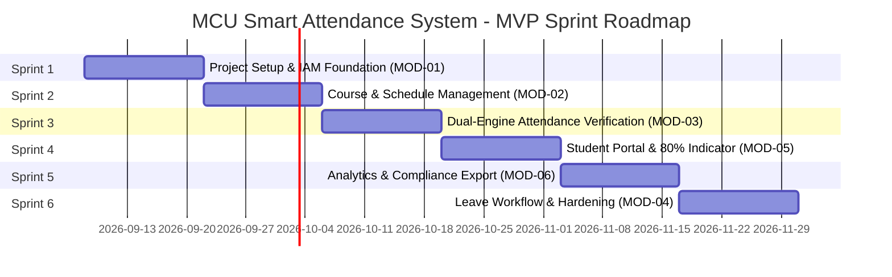

# Phased Implementation Plan & Sprint Roadmap
## โครงการ: ระบบเช็คชื่อ มหาวิทยาลัยมหาจุฬาลงกรณราชวิทยาลัย (MCU Smart Attendance System)
**เวอร์ชัน:** 1.0.0 (MVP)  
**วิธีการพัฒนา:** Agile Scrum + Vibe Coding (AI-Assisted Sprint Execution)  
**ระยะเวลารวม:** 6 Sprints (Sprint ละ 2 สัปดาห์ รวม 12 สัปดาห์สู่ Production MVP)

---

## 1. Global Definition of Done (DoD)

ทุก Task และทุก User Story จะถือว่าเสร็จสมบูรณ์ (Done) ก็ต่อเมื่อผ่านเกณฑ์ทั้งหมดดังต่อไปนี้:
1. **Code Completeness:** เขียนโค้ดตาม TypeScript Strict Mode ปราศจากคำสั่ง `any` และไม่มี Linter Warnings
2. **Schema & Migration:** มีไฟล์ Prisma Migration ที่ผ่านการทดสอบรันบน Local PostgreSQL และไม่มีข้อผิดพลาด
3. **Automated Verification:** Unit Tests / Integration Tests ในฟังก์ชันทางธุรกิจหลัก (Dynamic QR Validation, 80% Rule Calculation) ผ่าน 100%
4. **Security & Validation:** ข้อมูลนำเข้าทั้งหมดผ่านการตรวจสอบด้วย Zod Schema ทั้งฝั่งหน้าบ้านและหลังบ้าน
5. **UI & Accessibility:** หน้าจอแสดงผลได้ถูกต้องทั้งบน Mobile Browser (iPhone Safari, Android Chrome, LINE In-App Browser) และ Desktop รองรับ WCAG 2.1 AA
6. **Documentation & Memory:** อัปเดตสถานะงานลงใน `progress.md` และสร้าง Git Commit ตามมาตรฐาน Conventional Commits

---

## 2. Sprint Roadmap Breakdown



---

### Sprint 1: Project Setup, Database Migration & IAM Foundation (MOD-01)
* **เป้าหมาย:** วางโครงสร้างโปรเจกต์ Next.js 15, ตั้งค่าฐานข้อมูล PostgreSQL/Redis, ระบบ Authentication (NextAuth) และระบบจัดการสิทธิ์ผู้ใช้งาน (RBAC)
* **Task Checklist:**
  - [ ] **Task 1.1:** เริ่มต้นโปรเจกต์ Next.js 15 (App Router, Tailwind CSS, TypeScript, shadcn/ui) พร้อมตั้งค่า `.env.example`
  - [ ] **Task 1.2:** เขียนไฟล์ `prisma/schema.prisma` ตาม `schema.md` และรันคำสั่ง `npx prisma migrate dev --name init_mcu_schema`
  - [ ] **Task 1.3:** สร้าง Script Seed ข้อมูลเริ่มต้น (`prisma/seed.ts`) สำหรับวิทยาเขตหลัก (วังน้อย), คณะพุทธศาสตร์, คณะสังคมศาสตร์ และบัญชี Super Admin
  - [ ] **Task 1.4:** พัฒนาระบบยืนยันตัวตน (NextAuth.js v5) รองรับการล็อกอินด้วย Username/Password และออก JWT Token ที่มี Claims: `role`, `campusId`, `userType`
  - [ ] **Task 1.5:** สร้าง Middleware (`src/middleware.ts`) ตรวจสอบสิทธิ์การเข้าถึงแยก Route กลุ่ม `/student/*`, `/instructor/*`, `/registrar/*`, `/admin/*`
  - [ ] **Task 1.6:** พัฒนาหน้าจอ Login (`/login`) ที่มี UI เรียบง่าย รองรับทั้งภาษาไทยและอังกฤษ
  - [ ] **Task 1.7:** พัฒนาระบบ Bulk User Import (`/registrar/import`) รองรับการอัปโหลดไฟล์ Excel/CSV บันทึกบัญชีผู้ใช้ลงตาราง `users`
* **Verification Command:**
  ```bash
  npx prisma migrate status
  npm run test:auth
  ```

---

### Sprint 2: Curriculum & Schedule Management (MOD-02)
* **เป้าหมาย:** สร้างระบบจัดการภาคการศึกษา, รายวิชาที่เปิดสอน (Course Offerings), การลงทะเบียนนิสิต และเครื่องมือสร้างรอบเช็คชื่อ 16 สัปดาห์อัตโนมัติ
* **Task Checklist:**
  - [ ] **Task 2.1:** พัฒนา CRUD Service สำหรับ `AcademicTerm` และ `CourseOffering`
  - [ ] **Task 2.2:** พัฒนาฟังก์ชันลงทะเบียนนิสิตเข้าสู่วิชา (`CourseEnrollment`) ทั้งแบบเลือกทีละคนและอัปโหลดจากไฟล์ Excel
  - [ ] **Task 2.3:** พัฒนาหน้าจอแสดงตารางสอนของอาจารย์ (`/instructor/courses`) แสดงการ์ดวิชาที่สอนในเทอมปัจจุบัน
  - [ ] **Task 2.4:** พัฒนาเครื่องมือสร้างรอบเช็คชื่ออัตโนมัติ (Recurring Schedule Generator) สร้าง Record ใน `attendance_sessions` ล่วงหน้า 16 สัปดาห์
  - [ ] **Task 2.5:** พัฒนาหน้าจอตั้งค่าเกณฑ์เวลาของคาบเรียน (เวลาเริ่ม, เวลาสิ้นสุด, เกณฑ์นับสาย `lateThresholdMinutes`, และประเภทกิจกรรม `SessionType`)
* **Verification Command:**
  ```bash
  npm run test:schedule
  ```

---

### Sprint 3: Dual-Engine Attendance Verification (MOD-03)
* **เป้าหมาย:** พัฒนากลไกการเช็คชื่อ 2 รูปแบบ: Dynamic Time-based QR Code (พร้อมจอฉายในห้องเรียน) และหน้าจอ Manual Roster สำหรับให้อาจารย์เช็คแทน
* **Task Checklist:**
  - [ ] **Task 3.1:** พัฒนา Dynamic QR Token Generator ใช้ HMAC-SHA256 (SessionID + Rotating Salt + Timestamp) บันทึก Token ลง Redis (TTL 25 วินาที)
  - [ ] **Task 3.2:** สร้าง Route Handler สตรีม Token ผ่าน Server-Sent Events (SSE) ที่ `/api/attendance/qr/stream`
  - [ ] **Task 3.3:** พัฒนาหน้าจอ Projector Display (`/instructor/sessions/[id]/present`) สำหรับฉาย QR Code ขนาดใหญ่บนจอห้องเรียน พร้อมแสดงตัวเลขนับยอดผู้เข้าเรียนแบบ Real-time
  - [ ] **Task 3.4:** พัฒนาหน้าจอนิสิตสแกน QR ผ่านสมาร์ทโฟน (`/student/scan`) เชื่อมต่อกล้องผ่าน HTML5 QR Scanner
  - [ ] **Task 3.5:** พัฒนา Server Action ตรวจสอบ Token สแกน: ตรวจสอบความถูกต้องจาก Redis, เช็คสถานะเวลาเทียบกับ Server NTP Clock, และบันทึกลง `attendance_records`
  - [ ] **Task 3.6:** พัฒนาระบบสร้างเลขอ้างอิงสแกน (Reference Code เช่น `MCU-2026-X89B1`) ป้องกันการบันทึกซ้ำซ้อนด้วย Composite Unique Key
  - [ ] **Task 3.7:** พัฒนาหน้าจอ Manual Roster Check-in (`/instructor/sessions/[id]/roster`) ให้อาจารย์ค้นหาชื่อและคลิกทำเครื่องหมาย มา/สาย/ขาด ได้โดยตรง
* **Verification Command:**
  ```bash
  npm run test:attendance-engine
  ```

---

### Sprint 4: Student Portal & 80% Early Warning System (MOD-05)
* **เป้าหมาย:** พัฒนาหน้ารวมข้อมูลสำหรับนิสิต แสดงสถิติการเข้าเรียนสะสม และระบบแถบสีแจ้งเตือนความเสี่ยงหมดสิทธิ์สอบ
* **Task Checklist:**
  - [ ] **Task 4.1:** พัฒนา Service รวมสถิติเวลาเรียน (`StudentPortalService.getAggregatedAttendance`) คำนวณยอด มา, สาย, ขาด, ลา
  - [ ] **Task 4.2:** พัฒนาสูตรคำนวณร้อยละเวลาเรียนสะสม (% Attendance Rate) ตามเกณฑ์ระเบียบ มจร
  - [ ] **Task 4.3:** พัฒนาหน้า Dashboard นิสิต (`/student/portal`) แสดงการ์ดสรุปทุกวิชาที่ลงทะเบียน
  - [ ] **Task 4.4:** พัฒนา Visual Indicator แถบสีแจ้งเตือนความเสี่ยง: เขียว ($\ge 85\%$), เหลือง ($80\% - 84.9\%$), แดง ($< 80\%$)
  - [ ] **Task 4.5:** พัฒนาหน้ารายละเอียดประวัติการเข้าเรียนรายคาบ (`/student/courses/[id]`) แสดงวันเวลาและวิธีการเช็คชื่อ
* **Verification Command:**
  ```bash
  npm run test:student-calc
  ```

---

### Sprint 5: Analytics, Exam Eligibility & Compliance Export (MOD-06)
* **เป้าหมาย:** พัฒนาระบบสรุปผลเวลาเรียน ตัดยอดสิทธิ์สอบประจำภาค และเครื่องมือส่งออกรายงาน Excel/PDF สำหรับงานประกันคุณภาพ
* **Task Checklist:**
  - [ ] **Task 5.1:** พัฒนา Service ตัดยอดสิทธิ์สอบ (`ReportingService.calculateExamEligibility`) จำแนกรายชื่อเป็น "มีสิทธิ์สอบ" และ "หมดสิทธิ์สอบ"
  - [ ] **Task 5.2:** พัฒนาหน้าจอสรุปผลของฝ่ายทะเบียน (`/registrar/eligibility`) พร้อมฟังก์ชันกรองตามคณะ, ภาควิชา, และอาจารย์ผู้สอน
  - [ ] **Task 5.3:** พัฒนาฟังก์ชันสร้างไฟล์ Excel (.xlsx) ด้วยไลบรารี `exceljs` จัดรูปแบบหัวตารางภาษาไทยและสูตรสรุปผลถูกต้อง
  - [ ] **Task 5.4:** พัฒนาหน้าจอสั่งพิมพ์ใบสรุปเวลาเรียน (`Printable Attendance Sheet`) จัดรูปแบบ A4 พร้อมช่องลงนามอาจารย์ผู้สอน
  - [ ] **Task 5.5:** พัฒนา Executive Summary Widget สำหรับผู้บริหารวิทยาเขต แสดงอัตราการเข้าเรียนเฉลี่ยรายคณะ
* **Verification Command:**
  ```bash
  npm run test:reports
  ```

---

### Sprint 6: Leave Request Workflow, Audit Trail & Hardening (MOD-04)
* **เป้าหมาย:** พัฒนาระบบยื่นใบลาพร้อมแนบไฟล์, ขั้นตอนการอนุมัติของผู้สอน, ตาราง Audit Log และการทดสอบระบบรับโหลด
* **Task Checklist:**
  - [ ] **Task 6.1:** ติดตั้ง MinIO Client ใน `src/lib/storage/` รองรับการอัปโหลดไฟล์หลักฐานใบรับรองแพทย์/ใบฎีกานิมนต์
  - [ ] **Task 6.2:** พัฒนาหน้าจอพระนิสิตยื่นใบลา (`/student/leave/new`) รองรับประเภท `RELIGIOUS_DUTY`, `SICK`, `BUSINESS`
  - [ ] **Task 6.3:** พัฒนาหน้าจออาจารย์ตรวจสอบและกดอนุมัติ/ปฏิเสธใบลา (`/instructor/leaves`) พร้อมอัปเดตสถานะใน `attendance_records`
  - [ ] **Task 6.4:** พัฒนา Service บันทึก `audit_logs` แบบ Append-Only ทุกครั้งที่มีการแก้สถานะเวลาเรียนหรืออนุมัติใบลา
  - [ ] **Task 6.5:** ทำการทดสอบ Stress Test จำลองการสแกน QR Code พร้อมกัน 1,500 Requests/Minute ด้วย k6 หรือ autocannon
  - [ ] **Task 6.6:** จัดเตรียม Production Dockerfile และ docker-compose.prod.yml สำหรับส่งมอบฝ่ายไอที มจร
* **Verification Command:**
  ```bash
  npm run test:e2e
  npm run test:load
  ```
