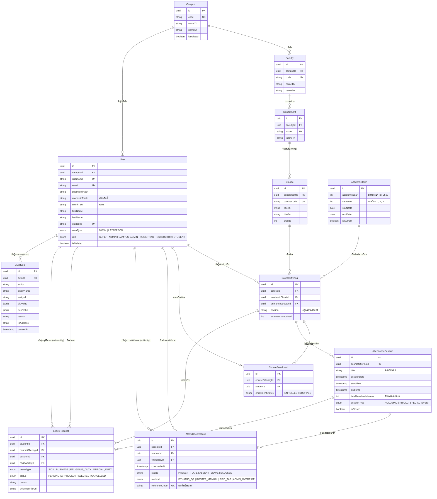

# Database Schema & Data Models Specification
## โครงการ: ระบบเช็คชื่อ มหาวิทยาลัยมหาจุฬาลงกรณราชวิทยาลัย (MCU Smart Attendance System)
**เวอร์ชัน:** 1.0.0 (MVP)  
**ฐานข้อมูลหลัก:** PostgreSQL 16  
**ORM:** Prisma ORM 6.x  
**มาตรฐานการตั้งชื่อ:**
- ตารางในฐานข้อมูล (PostgreSQL): `snake_case` พหูพจน์ (เช่น `users`, `attendance_sessions`)
- โมเดลใน Prisma Schema: `PascalCase` เอกพจน์ (เช่น `User`, `AttendanceSession`)
- ฟิลด์ (Attributes): `camelCase` (เช่น `studentId`, `verifiedAt`, `isDeleted`)
- Enums: `SCREAMING_SNAKE_CASE` (เช่น `DYNAMIC_QR`, `RELIGIOUS_DUTY`)

---

## 1. Entity Relationship Diagram (Mermaid ERD)



---

## 2. Enums Definition (ค่าคงที่ระบบ)

```prisma
// ประเภทของผู้ใช้งาน (อัตลักษณ์มหาวิทยาลัยสงฆ์)
enum UserType {
  MONK        // พระภิกษุ / สามเณร (บรรพชิต)
  LAYPERSON   // คฤหัสถ์ (ฆราวาส)
}

// สิทธิ์การเข้าถึงระบบตามบทบาท (RBAC)
enum RoleType {
  SUPER_ADMIN   // ผู้ดูแลระบบส่วนกลาง (ศูนย์คอมพิวเตอร์ มจร)
  CAMPUS_ADMIN  // ผู้บริหารวิทยาเขต / คณบดี
  REGISTRAR     // เจ้าหน้าที่สำนักทะเบียนและวัดผล
  INSTRUCTOR    // อาจารย์ผู้สอน / พระอาจารย์ประจำวิชา
  STUDENT       // พระนิสิต / นิสิตคฤหัสถ์
}

// สถานะการเข้าชั้นเรียนหรือกิจกรรม
enum AttendanceStatus {
  PRESENT   // มาเรียนตรงเวลา
  LATE      // มาสาย (เกินเวลาที่กำหนดแต่น้อยกว่าเวลาปิดรับ)
  ABSENT    // ขาดเรียน (ไม่มาเช็คชื่อ หรือสายเกินเวลาที่อนุโลม)
  LEAVE     // ลา (ยื่นคำร้องขอลาถูกต้อง)
  EXCUSED   // อนุโลมเป็นกรณีพิเศษ (เช่น ปฏิบัติศาสนกิจของทางมหาวิทยาลัย)
}

// ช่องทางหรือวิธีการที่ใช้ในการเช็คชื่อ
enum VerificationMethod {
  DYNAMIC_QR       // สแกน QR Code แบบหมุนเวียนรหัสตามเวลา
  ROSTER_MANUAL    // ผู้สอนหรือเจ้าหน้าที่ตรวจเช็คในใบรายชื่อโดยตรง
  RFID_TAP         // ทาบบัตรสมาร์ทการ์ด (เตรียมไว้สำหรับอนาคต)
  ADMIN_OVERRIDE   // ผู้ดูแลระบบหรือฝ่ายทะเบียนปรับแก้สถานะย้อนหลัง
}

// ประเภทของกิจกรรมหรือคาบเรียน
enum SessionType {
  ACADEMIC        // คาบเรียนตามหลักสูตรวิชาการ
  RITUAL          // กิจกรรมวัตรปฏิบัติ / ศาสนพิธี / สวดมนต์ทำวัตร
  MEDITATION      // การฝึกอบรมวิปัสสนากรรมฐานประจำปี
  SPECIAL_EVENT   // กิจกรรมพิเศษ / สัมมนา / พิธีการมหาวิทยาลัย
}

// ประเภทของการขอลา
enum LeaveType {
  SICK            // ลาป่วย (มีหรือไม่มีใบรับรองแพทย์)
  BUSINESS        // ลากิจธุระจำเป็น
  RELIGIOUS_DUTY  // ติดศาสนกิจ / กิจนิมนต์ / งานพระพุทธศาสนา
  OFFICIAL_DUTY   // ปฏิบัติหน้าที่ราชการ / ได้รับมอบหมายจากมหาวิทยาลัย
}

// สถานะของคำขอลา
enum LeaveStatus {
  PENDING    // รอการพิจารณาจากอาจารย์ผู้สอน
  APPROVED   // อนุมัติ (ปรับสถานะเป็น LEAVE หรือ EXCUSED)
  REJECTED   // ไม่อนุมัติ (คงสถานะเป็น ABSENT)
  CANCELLED  // ยกเลิกโดยนิสิตผู้ยื่น
}

// สถานะการลงทะเบียนรายวิชา
enum EnrollmentStatus {
  ENROLLED   // ลงทะเบียนเรียนปกติ
  DROPPED    // ถอนรายวิชา
  WITHDRAWN  // ถอนรายวิชาโดยติด W
}
```

---

## 3. Database Tables & Field Specifications

### 3.1 ตารางผู้ใช้และโครงสร้างองค์กร (User & Organization)
* **`users`**: จัดเก็บข้อมูลผู้ใช้งานทุกคน ทั้งพระภิกษุและฆราวาส มีฟิลด์รองรับสมณศักดิ์ (`monasticRank`) ฉายาพระ (`monkTitle`) และรองรับ Soft Delete
* **`campuses`**: รายชื่อวิทยาเขต มจร เช่น ส่วนกลาง วังน้อย, วิทยาเขตเชียงใหม่, วิทยาเขตขอนแก่น
* **`faculties`**: คณะ เช่น คณะพุทธศาสตร์, คณะครุศาสตร์, คณะมนุษยศาสตร์, คณะสังคมศาสตร์, บัณฑิตวิทยาลัย
* **`departments`**: ภาควิชา/สาขาวิชา

### 3.2 ตารางการจัดการเรียนการสอน (Curriculum & Schedule)
* **`academic_terms`**: ภาคการศึกษา (เช่น ปีการศึกษา 2569 ภาคเรียนที่ 1) มี Flag `isCurrent` ระบุภาคเรียนปัจจุบัน
* **`courses`**: รายวิชาหลักสูตรกลาง (เช่น 000 101 ภาษาไทยเพื่อการสื่อสาร, 000 103 พระพุทธศาสนากับวิทยาศาสตร์)
* **`course_offerings`**: รายวิชาที่เปิดสอนจริงในแต่ละเทอม แยกตามกลุ่มเรียน (Section) และอาจารย์ผู้รับผิดชอบ
* **`course_enrollments`**: ตารางจับคู่นิสิตเข้ากับวิชาที่เปิดสอน มี Unique Constraint `(courseOfferingId, studentId)`

### 3.3 ตารางการเช็คชื่อและใบลา (Attendance & Leave)
* **`attendance_sessions`**: รอบการเช็คชื่อรายคาบ เช่น "สัปดาห์ที่ 3: ปรัชญาเถรวาท" กำหนด `startTime`, `endTime`, `lateThresholdMinutes`
* **`attendance_records`**: บันทึกการเข้าเรียนรายบุคคล **มี Composite Unique Key `(sessionId, studentId)`** ป้องกันการบันทึกซ้ำในรอบเดียวกันอย่างเด็ดขาด
* **`leave_requests`**: คำขอลาพร้อมแนบ URL เอกสารหลักฐานจาก MinIO มีฟิลด์อ้างอิงผู้อนุมัติ (`reviewedById`) และเหตุผล

### 3.4 ตารางตรวจสอบความถูกต้องและระบบ (Audit & Settings)
* **`audit_logs`**: ตารางบันทึกประวัติการแก้ไขข้อมูลสำคัญแบบ Append-Only ห้ามลบหรือแก้ไขเด็ดขาด
* **`system_settings`**: จัดเก็บค่าคอนฟิกส่วนกลาง เช่น `DEFAULT_LATE_THRESHOLD_MINUTES`, `ATTENDANCE_PASSING_PERCENTAGE` (80%)

---

## 4. Complete Prisma Schema Definition (`schema.prisma`)

```prisma
datasource db {
  provider = "postgresql"
  url      = env("DATABASE_URL")
}

generator client {
  provider = "prisma-client-js"
}

// -------------------------------------------------------------
// 1. ORGANIZATIONAL HIERARCHY
// -------------------------------------------------------------

model Campus {
  id          String       @id @default(uuid()) @db.Uuid
  code        String       @unique @db.VarChar(20)
  nameTh      String       @db.VarChar(150)
  nameEn      String?      @db.VarChar(150)
  isDeleted   Boolean      @default(false) @map("is_deleted")
  createdAt   DateTime     @default(now()) @map("created_at")
  updatedAt   DateTime     @updatedAt @map("updated_at")

  faculties   Faculty[]
  users       User[]

  @@map("campuses")
}

model Faculty {
  id          String       @id @default(uuid()) @db.Uuid
  campusId    String       @map("campus_id") @db.Uuid
  code        String       @unique @db.VarChar(20)
  nameTh      String       @db.VarChar(150)
  nameEn      String?      @db.VarChar(150)
  isDeleted   Boolean      @default(false) @map("is_deleted")
  createdAt   DateTime     @default(now()) @map("created_at")
  updatedAt   DateTime     @updatedAt @map("updated_at")

  campus      Campus       @relation(fields: [campusId], references: [id], onDelete: Restrict)
  departments Department[]

  @@index([campusId])
  @@map("faculties")
}

model Department {
  id          String       @id @default(uuid()) @db.Uuid
  facultyId   String       @map("faculty_id") @db.Uuid
  code        String       @unique @db.VarChar(20)
  nameTh      String       @db.VarChar(150)
  nameEn      String?      @db.VarChar(150)
  isDeleted   Boolean      @default(false) @map("is_deleted")
  createdAt   DateTime     @default(now()) @map("created_at")
  updatedAt   DateTime     @updatedAt @map("updated_at")

  faculty     Faculty      @relation(fields: [facultyId], references: [id], onDelete: Restrict)
  courses     Course[]

  @@index([facultyId])
  @@map("departments")
}

// -------------------------------------------------------------
// 2. USER & AUTHENTICATION
// -------------------------------------------------------------

model User {
  id             String       @id @default(uuid()) @db.Uuid
  campusId       String?      @map("campus_id") @db.Uuid
  username       String       @unique @db.VarChar(50)
  email          String       @unique @db.VarChar(100)
  passwordHash   String       @map("password_hash") @db.VarChar(255)
  
  // อัตลักษณ์บุคคล (รองรับพระภิกษุและฆราวาส)
  userType       UserType     @default(LAYPERSON) @map("user_type")
  role           RoleType     @default(STUDENT)
  monasticRank   String?      @map("monastic_rank") @db.VarChar(100) // เช่น "พระมหา", "พระครูปลัด"
  monkTitle      String?      @map("monk_title") @db.VarChar(100)    // ฉายาพระ เช่น "ฐิตธมฺโม", "วชิรเมธี"
  firstName      String       @map("first_name") @db.VarChar(100)
  lastName       String?      @map("last_name") @db.VarChar(100)     // ว่างได้สำหรับพระสงฆ์
  studentId      String?      @unique @map("student_id") @db.VarChar(30)
  nationalId     String?      @map("national_id") @db.VarChar(20)
  phoneNumber    String?      @map("phone_number") @db.VarChar(20)
  avatarUrl      String?      @map("avatar_url") @db.Text
  
  isActive       Boolean      @default(true) @map("is_active")
  isDeleted      Boolean      @default(false) @map("is_deleted")
  deletedAt      DateTime?    @map("deleted_at")
  createdAt      DateTime     @default(now()) @map("created_at")
  updatedAt      DateTime     @updatedAt @map("updated_at")

  campus         Campus?      @relation(fields: [campusId], references: [id], onDelete: SetNull)
  instructingCourses CourseOffering[] @relation("InstructorCourses")
  enrollments    CourseEnrollment[]
  attendanceRecords AttendanceRecord[] @relation("StudentAttendances")
  verifiedRecords AttendanceRecord[]  @relation("VerifierAttendances")
  submittedLeaves LeaveRequest[]     @relation("StudentLeaves")
  reviewedLeaves LeaveRequest[]      @relation("ReviewerLeaves")
  auditActions   AuditLog[]

  @@index([campusId])
  @@index([role])
  @@index([studentId])
  @@map("users")
}

// -------------------------------------------------------------
// 3. CURRICULUM & ACADEMIC OFFERINGS
// -------------------------------------------------------------

model AcademicTerm {
  id           String           @id @default(uuid()) @db.Uuid
  academicYear Int              @map("academic_year") // ปีการศึกษา พ.ศ. เช่น 2569
  semester     Int              // 1, 2 หรือ 3 (ฤดูร้อน)
  startDate    DateTime         @map("start_date") @db.Date
  endDate      DateTime         @map("end_date") @db.Date
  isCurrent    Boolean          @default(false) @map("is_current")
  createdAt    DateTime         @default(now()) @map("created_at")
  updatedAt    DateTime         @updatedAt @map("updated_at")

  offerings    CourseOffering[]

  @@unique([academicYear, semester])
  @@map("academic_terms")
}

model Course {
  id           String           @id @default(uuid()) @db.Uuid
  departmentId String           @map("department_id") @db.Uuid
  courseCode   String           @unique @map("course_code") @db.VarChar(20)
  titleTh      String           @map("title_th") @db.VarChar(200)
  titleEn      String?          @map("title_en") @db.VarChar(200)
  credits      Int              @default(3)
  isDeleted    Boolean          @default(false) @map("is_deleted")
  createdAt    DateTime         @default(now()) @map("created_at")
  updatedAt    DateTime         @updatedAt @map("updated_at")

  department   Department       @relation(fields: [departmentId], references: [id], onDelete: Restrict)
  offerings    CourseOffering[]

  @@index([departmentId])
  @@map("courses")
}

model CourseOffering {
  id                   String             @id @default(uuid()) @db.Uuid
  courseId             String             @map("course_id") @db.Uuid
  academicTermId       String             @map("academic_term_id") @db.Uuid
  primaryInstructorId  String             @map("primary_instructor_id") @db.Uuid
  section              String             @default("01") @db.VarChar(10)
  roomNumber           String?            @map("room_number") @db.VarChar(50)
  totalHoursRequired   Int                @default(45) @map("total_hours_required")
  isDeleted            Boolean            @default(false) @map("is_deleted")
  createdAt            DateTime           @default(now()) @map("created_at")
  updatedAt            DateTime           @updatedAt @map("updated_at")

  course               Course             @relation(fields: [courseId], references: [id], onDelete: Restrict)
  academicTerm         AcademicTerm       @relation(fields: [academicTermId], references: [id], onDelete: Restrict)
  primaryInstructor    User               @relation("InstructorCourses", fields: [primaryInstructorId], references: [id], onDelete: Restrict)
  enrollments          CourseEnrollment[]
  sessions             AttendanceSession[]
  leaveRequests        LeaveRequest[]

  @@unique([courseId, academicTermId, section])
  @@index([academicTermId])
  @@index([primaryInstructorId])
  @@map("course_offerings")
}

model CourseEnrollment {
  id               String           @id @default(uuid()) @db.Uuid
  courseOfferingId String           @map("course_offering_id") @db.Uuid
  studentId        String           @map("student_id") @db.Uuid
  status           EnrollmentStatus @default(ENROLLED)
  enrolledAt       DateTime         @default(now()) @map("enrolled_at")
  createdAt        DateTime         @default(now()) @map("created_at")
  updatedAt        DateTime         @updatedAt @map("updated_at")

  courseOffering   CourseOffering   @relation(fields: [courseOfferingId], references: [id], onDelete: Cascade)
  student          User             @relation(fields: [studentId], references: [id], onDelete: Restrict)

  @@unique([courseOfferingId, studentId])
  @@index([studentId])
  @@map("course_enrollments")
}

// -------------------------------------------------------------
// 4. ATTENDANCE & LEAVE ENGINE
// -------------------------------------------------------------

model AttendanceSession {
  id                   String             @id @default(uuid()) @db.Uuid
  courseOfferingId     String             @map("course_offering_id") @db.Uuid
  title                String             @db.VarChar(150) // เช่น "สัปดาห์ที่ 1 บทนำระเบียบวิธีวิจัย"
  sessionDate          DateTime           @map("session_date") @db.Date
  startTime            DateTime           @map("start_time")
  endTime              DateTime           @map("end_time")
  lateThresholdMinutes Int                @default(15) @map("late_threshold_minutes")
  sessionType          SessionType        @default(ACADEMIC) @map("session_type")
  isClosed             Boolean            @default(false) @map("is_closed")
  closedAt             DateTime?          @map("closed_at")
  createdAt            DateTime           @default(now()) @map("created_at")
  updatedAt            DateTime           @updatedAt @map("updated_at")

  courseOffering       CourseOffering     @relation(fields: [courseOfferingId], references: [id], onDelete: Cascade)
  attendanceRecords    AttendanceRecord[]
  leaveRequests        LeaveRequest[]

  @@index([courseOfferingId])
  @@index([sessionDate])
  @@map("attendance_sessions")
}

model AttendanceRecord {
  id            String             @id @default(uuid()) @db.Uuid
  sessionId     String             @map("session_id") @db.Uuid
  studentId     String             @map("student_id") @db.Uuid
  verifiedById  String?            @map("verified_by_id") @db.Uuid
  checkedInAt   DateTime           @default(now()) @map("checked_in_at")
  status        AttendanceStatus   @default(PRESENT)
  method        VerificationMethod @default(DYNAMIC_QR)
  referenceCode String             @unique @map("reference_code") @db.VarChar(40) // เช่น MCU-2026-X89B1
  note          String?            @db.VarChar(255)
  ipAddress     String?            @map("ip_address") @db.VarChar(45)
  userAgent     String?            @map("user_agent") @db.Text
  createdAt     DateTime           @default(now()) @map("created_at")
  updatedAt     DateTime           @updatedAt @map("updated_at")

  session       AttendanceSession  @relation(fields: [sessionId], references: [id], onDelete: Cascade)
  student       User               @relation("StudentAttendances", fields: [studentId], references: [id], onDelete: Restrict)
  verifiedBy    User?              @relation("VerifierAttendances", fields: [verifiedById], references: [id], onDelete: SetNull)

  // Composite Unique: 1 คน มีได้ 1 Record ต่อ 1 Session เท่านั้น
  @@unique([sessionId, studentId])
  @@index([studentId])
  @@index([status])
  @@map("attendance_records")
}

model LeaveRequest {
  id               String         @id @default(uuid()) @db.Uuid
  studentId        String         @map("student_id") @db.Uuid
  courseOfferingId String         @map("course_offering_id") @db.Uuid
  sessionId        String?        @map("session_id") @db.Uuid
  reviewedById     String?        @map("reviewed_by_id") @db.Uuid
  leaveType        LeaveType      @default(SICK) @map("leave_type")
  status           LeaveStatus    @default(PENDING)
  reason           String         @db.Text
  evidenceFileUrl  String?        @map("evidence_file_url") @db.Text
  reviewNote       String?        @map("review_note") @db.VarChar(255)
  reviewedAt       DateTime?      @map("reviewed_at")
  createdAt        DateTime       @default(now()) @map("created_at")
  updatedAt        DateTime       @updatedAt @map("updated_at")

  student          User           @relation("StudentLeaves", fields: [studentId], references: [id], onDelete: Restrict)
  courseOffering   CourseOffering @relation(fields: [courseOfferingId], references: [id], onDelete: Cascade)
  session          AttendanceSession? @relation(fields: [sessionId], references: [id], onDelete: SetNull)
  reviewedBy       User?          @relation("ReviewerLeaves", fields: [reviewedById], references: [id], onDelete: SetNull)

  @@index([studentId])
  @@index([courseOfferingId])
  @@index([status])
  @@map("leave_requests")
}

// -------------------------------------------------------------
// 5. AUDIT & SYSTEM SETTINGS
// -------------------------------------------------------------

model AuditLog {
  id         String   @id @default(uuid()) @db.Uuid
  actorId    String?  @map("actor_id") @db.Uuid
  action     String   @db.VarChar(100) // เช่น "UPDATE_ATTENDANCE_STATUS", "APPROVE_LEAVE"
  entityName String   @map("entity_name") @db.VarChar(50) // เช่น "AttendanceRecord"
  entityId   String   @map("entity_id") @db.VarChar(50)
  oldValue   Json?    @map("old_value")
  newValue   Json?    @map("new_value")
  reason     String?  @db.VarChar(255)
  ipAddress  String?  @map("ip_address") @db.VarChar(45)
  userAgent  String?  @map("user_agent") @db.Text
  createdAt  DateTime @default(now()) @map("created_at")

  actor      User?    @relation(fields: [actorId], references: [id], onDelete: SetNull)

  @@index([entityName, entityId])
  @@index([actorId])
  @@index([createdAt])
  @@map("audit_logs")
}

model SystemSetting {
  id          String   @id @default(uuid()) @db.Uuid
  key         String   @unique @db.VarChar(100)
  value       String   @db.Text
  description String?  @db.VarChar(255)
  updatedAt   DateTime @updatedAt @map("updated_at")

  @@map("system_settings")
}
```

---

## 5. Soft Delete Rules & Data Retention Policy

1. **Soft Delete Implementation:**
   * ตารางหลัก (`users`, `campuses`, `faculties`, `departments`, `courses`, `course_offerings`) มีฟิลด์ `isDeleted Boolean @default(false)` และ `deletedAt DateTime?`
   * การ Query ดึงข้อมูลปกติจะต้องเพิ่มเงื่อนไข `where: { isDeleted: false }` ผ่าน Prisma Client Extensions เสมอ
2. **Hard Delete Policy:**
   * ตารางประวัติการทำรายการ (`attendance_records`, `leave_requests`) **ไม่อนุญาตให้ทำ Soft Delete หรือ Hard Delete** โดยผู้ใช้งานทั่วไป หากข้อมูลผิดพลาด ให้ใช้วิธีการ Override สถานะและระบุเหตุผลเพื่อเก็บบันทึกลง `audit_logs`
3. **Data Retention:**
   * บันทึกในตาราง `attendance_records` และ `audit_logs` ต้องจัดเก็บไว้ในฐานข้อมูลอย่างน้อย **5 ปีการศึกษา** เพื่อรองรับการตรวจสอบจากสำนักงานการตรวจเงินแผ่นดิน (สตง.) และการตรวจประเมินคุณภาพการศึกษาของกระทรวง อว.
